<div align="center">

# RunawayContext

### Persistent context for any AI agent — with rules that hold themselves.

[](LICENSE)
[](pyproject.toml)
[](CHANGELOG.md)
[](.github/workflows/ci.yml)
[](pyproject.toml)
[](docs/HARD_RULES.md#hr-1--no-network-egress-by-default-ever-at-any-tier)
[](docs/HARD_RULES.md)

If you've explained the same project to your AI four times this week, this is for you. RunawayContext is a small Python library, CLI, and MCP server that gives any AI agent durable memory across sessions, projects, environments, users, and machines — coding assistants, custom Python agents, internal orchestration, enterprise workflows, customer-service bots. The architecture has rules; every rule has a test; the build won't ship if a rule drifts.

And it keeps your context window mostly empty. The always-loaded surface stays **≤3,000 tokens regardless of how much you've taught it** — usually a 70–95% reduction versus the giant instruction files most adopters are coming from. Deep knowledge lives in a SQLite database and retrieves only when the AI actually needs it.

[The problem](#the-problem-we-kept-hitting) ·
[What it is](#what-it-is) ·
[How it works](#how-it-works) ·
[Pick a tier](#the-six-rung-ladder) ·
[Install](#install--your-ai-does-it) ·
[Undo](#dont-like-it-the-undo-path)

</div>

---

## The problem we kept hitting

Every AI session starts from zero. You explain the project, the conventions, the gotchas, the people involved, the systems it integrates with. The AI nods, helps for an hour, then "forgets" by next session. You write a bigger and bigger rules file. The rules file itself starts eating your context window. The AI starts ignoring half of it. Six months later you're back to square one — except now you also have a 2,000-line instruction file that drifted out of alignment with what the agent is actually doing.

This is just as true for a coding session as it is for an enterprise automation agent or an internal customer-service bot — anywhere you have an AI that needs to remember "we tried that, it didn't work, going forward do X" and yet your only handle on its memory is a giant prompt or an instruction file that grew organically.

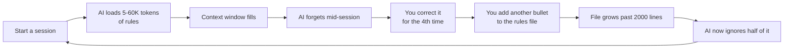

The naive fix — one giant instruction file — creates its own problems. The **harder** problem is that **even disciplined people drift**. Every session adds a "while I'm here, let me note this." Six months later the rules file is bloated, internally inconsistent, and quietly stops being enforced.

RunawayContext solves both. The **always-loaded surface stays under 3,000 tokens** regardless of how much knowledge you've accumulated. The **discipline is enforced in code**, not policy — the regenerator literally refuses to write briefs past their line cap. The deep knowledge lives in a SQLite database with full-text search and retrieves on demand.

---

## What it is

RunawayContext is a small Python library + CLI + MCP server that gives **any AI agent** a **structured memory** across sessions, projects, environments, machines, and humans — without growing into the giant rules file you're trying to escape.

**What "any AI agent" means in practice:**

- **AI coding assistants** — Claude Code, Cursor, Copilot, Aider, Windsurf, Codex CLI. They read project briefs and call MCP tools mid-conversation.
- **Custom Python agents** — anything that imports `runaway_context.Client` and calls `log_lesson(...)`, `search_lessons(...)`, `propose_knowledge(...)`. No LLM required by the library itself.
- **Internal AI workflows** — in-house orchestration agents, n8n flows, Temporal workers, queue consumers. Any process that needs durable, queryable project knowledge between runs.
- **Enterprise / customer-service bots** — agents that need persistent knowledge of their environment, their users, and the scar-tissue lessons learned across past interactions.
- **Anything that reads markdown** — even with no integration code, RunawayContext can write a per-project brief to a file your agent already reads.

Four things make it tick:

- **Local-first.** Zero network calls by default at every tier. Your knowledge stays on your disk.
- **Tier-progressive.** Start with a paste-once markdown template (T0). Grow into a 13-tool MCP server with semantic retrieval, lifecycle-aware lessons, and audit-log governance (T5). You only enable what you need.
- **The rules hold themselves.** Fifteen named rules (HR-1 through HR-15), each with a machine-checkable test. The discipline isn't a "be careful" line in the docs — it's code that fails the build the moment a rule drifts.
- **AI-native install.** Paste a prompt to your AI. It clones the repo, runs the test suite, runs diagnostics, walks a tier decision tree with you, and reports honestly. No hand-holding required.

> **Built by people who got tired of repeating themselves to their AI.** v1 launched April 2026 as a single-file release; v2 added split DBs, write guards, and a drift detector; v3 (this release) adds the 15 hard rules with named tests, the AI-native install loop, the MCP server, lifecycle-aware lessons, and a kind undo path. The reference implementation grew up driving enterprise-system integrations and an in-house AI orchestration agent — none of which are "coding assistants" in the classic sense.

---

## How it works

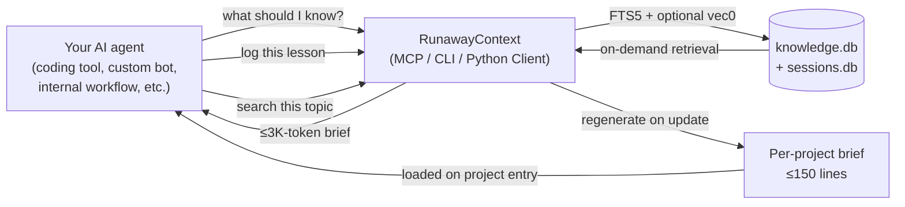

The flow has three sides, and each one is small on purpose.

**Your AI's view** is a brief — a short markdown file written by the regenerator. When the agent enters a project, the brief loads automatically. Coding tools read it where they already look (Claude Code reads `CLAUDE.md`, Cursor reads `.cursor/rules/`, Copilot reads `.github/copilot-instructions.md`). Custom Python agents call `Client.get_brief(project)` directly. Internal workflows include the brief in their system prompt. Either way, the brief contains the project's top warnings, active lessons, active references, and pointers into the database for everything else. It's capped at 150 lines and the regenerator **refuses** to write past that cap.

**The database** holds the deep knowledge: every lesson-learned, every reference chunk, every project manifest, every audit-log entry, every brief snapshot. It's SQLite with FTS5, project-tagged on every write, soft-delete-only, with a six-state maturation curve so old lessons drop out of briefs but stay queryable. Optional `sqlite-vec` integration adds vector retrieval on top of FTS5.

**The integration surface** is whichever fits your AI. The MCP server (`runaway mcp serve`) is the canonical path for clients that speak the Model Context Protocol — Claude Code, Cursor, custom MCP clients. The Python `Client` class is the canonical path for in-process agents, scheduled jobs, and orchestration code (`from runaway_context import Client`). The CLI (`runaway log-lesson ...`, `runaway search ...`) is the canonical path for shell scripts, n8n / Temporal nodes, and anywhere a subprocess is cleaner than a library import. All three surfaces enforce the same hard rules.

A typical interaction: the agent calls `search_chunks("retry policy")` mid-task and gets the relevant references. It calls `propose_lesson_draft(...)` when it notices scar tissue ("we got burned by X — going forward, do Y"). The draft sits in an inbox until a human approves it, so the AI cannot unilaterally bloat your knowledge base.

The whole loop is **measured**. Telemetry records retrieval latency, brief sizes, drift findings — local-only, never network. Drift detection runs every 10 minutes (cron) or on every session end (Stop hook), warning you when any always-loaded file grows past its cap.

---

## The token math

The architectural payoff is concrete: instead of loading every rule, convention, and gotcha on every session, your AI loads a small per-project brief plus pointers — and queries the database when it needs more.

A typical before / after on a single session start:

| Approach | Tokens loaded each session | Notes |
|---|---|---|
| Single `CLAUDE.md` at 500 lines | ~3,500 | Fine for now; will grow |
| Single `CLAUDE.md` at 2,000 lines | ~13,000 | Eating a real slice of your context window |
| `CLAUDE.md` + `AGENTS.md` + `.cursorrules` + inline pasted notes | ~16,000–60,000 | Common in the wild; often duplicated |
| Multi-project switcher across 5 projects, naive | ~25,000+ | Project A's rules pollute Project B's session |
| **RunawayContext** | **≤3,000** | Constant. The brief is line-capped (HR-5); the regenerator refuses to write past 150 lines. |

The bigger your knowledge corpus grows, the bigger the win — because RunawayContext loads a top-warnings + active-lessons brief at the top of each session, and your AI pulls the rest **on demand** through FTS5 (and optional `sqlite-vec`) when it actually needs it.

**A worked example.** A T2 install with 200 logged lessons and 500 reference chunks weighs about 4.5 MB on disk. A naive instruction-file approach holding equivalent content would be ~280K tokens — far past any current model's context window. RunawayContext loads 1,800–2,400 tokens at session start; the AI calls `search_lessons("...")` mid-task to pull what it needs. The 280K tokens still exist, but they're in `knowledge.db`, not your context window.

Said another way: you stop paying tokens for knowledge the AI doesn't need right now.

---

## Why v3 exists — the evolution

| Version | Released | What changed | Why |
|---|---|---|---|
| **v1** | 2026-04-03 | First public release as "SuperContext"; single-file SQLite layout; 4-tier knowledge architecture defined as policy. | Proved the model. |
| **v1.1** | 2026-04-07 | Renamed to RunawayContext. Added runaway-loop safeguards (token-budget caps, attempt limits) after a fuzzy-approval loop burned a third of a week's tokens. | Real incidents reshape the design. |
| **v2.0** | 2026-05-04 | Split DBs (`knowledge.db` + `sessions.db`), required project tagging on every write, drift detector, auto-generated briefs, multi-user setup helper. | v1's policy-only discipline drifted in real-world use. v2 moved the discipline into the schema and the regenerator. |
| **v2.0.1** | 2026-05-06 | Documentation tightening: closed a loophole where "optional detail files" in Tier 2 could re-introduce the bloat v2 was meant to prevent. | The spec must say what it means; ambiguity is a loophole. |
| **v3.0** | this release | Fifteen hard rules (HR-1..HR-15) each with a named test, AI-native install loop, 13-tool MCP server, six-state maturation curve, three-axis severity, slug lifecycle, trigger-based lesson capture, hash-chained audit log, environment doctor, kind undo path. | v2 enforced discipline. v3 enforces **the architecture itself** — every claim has a named test; loopholes are closed by construction. |

The architectural goal hasn't changed since v1: **minimize the always-loaded surface, route retrieval intelligently, keep the system honest over time**. What changed is how the honesty is enforced. In v3, every rule has a named test; every test must pass for the release to ship. The system polices itself.

---

## The six-rung ladder

You don't have to "set up RunawayContext." You pick a rung and grow into the next one when your situation outgrows it. Click any tier to expand its details.

<details>
<summary><strong>T0 — Hello World</strong> &nbsp;—&nbsp; You haven't logged anything yet. Markdown-only, no install.</summary>

<br>

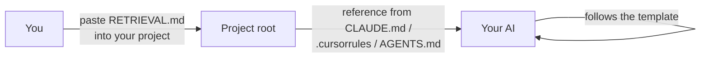

**Who:** anyone who wants a sane starting point but isn't ready to install anything.

**What's on:** a single markdown template (`RETRIEVAL.md`) you copy into your project root and reference from your AI tool's instructions file.

**What's off:** everything else. No DB, no Python, no install footprint.

**Resource budget:** ~50 KB on disk, 0 MB RAM, 0 bytes network.

**Promotion gate to T1:** you've accumulated 5+ project-specific notes manually and want them searchable.

**Rollback:** delete the markdown file. Done.

</details>

<details>
<summary><strong>T1 — Solo</strong> &nbsp;—&nbsp; Single developer, one machine. Full DB, no MCP.</summary>

<br>

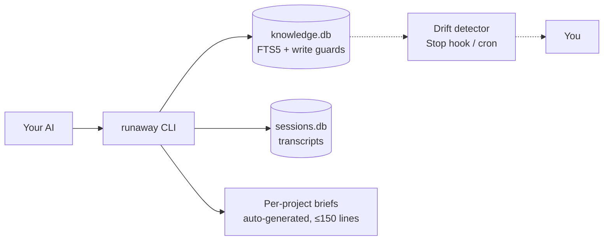

**Who:** a single developer on one machine.

**What's on:** the full v2 surface — `knowledge.db` + `sessions.db`, FTS5 search, project-tagged write guards (HR-2), auto-generated briefs with `PRESERVE_START/END` blocks for hand-curated content, drift detection on session end.

**What's off:** MCP, telemetry, semantic retrieval, record versioning, audit log.

**Resource budget:** ~80 MB RAM during CLI invocations; ~150 MB disk steady-state; 0 bytes network.

**Promotion gate to T2:** install has been used for ≥30 days, ≥10 lessons across ≥2 projects, ≥1 drift warning logged.

**Rollback:** disable T2+ features in config; T1 capabilities stay intact.

</details>

<details>
<summary><strong>T2 — Solo Power</strong> &nbsp;—&nbsp; Active multi-project developer. The most common starting point.</summary>

<br>

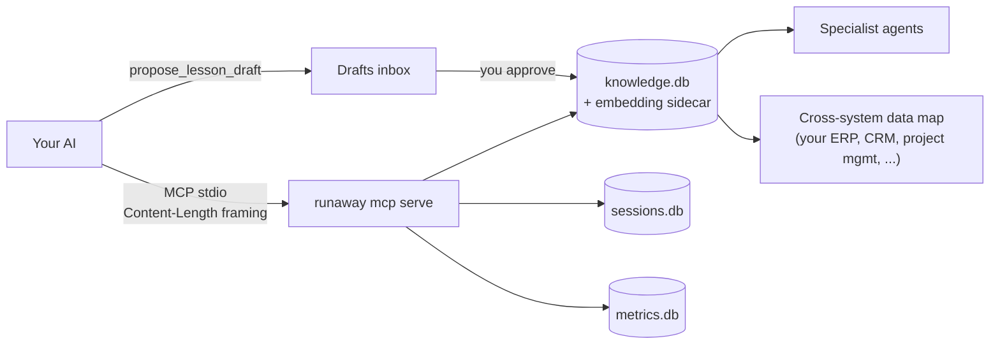

**Who:** an active multi-project solo developer who wants their AI integrated via MCP.

**What's on:** T1 plus the **13-tool MCP server**, local telemetry (never network), record versioning + soft-delete, predictive drift rules, multi-project stacking, optional semantic retrieval (FTS5 + sqlite-vec), specialist agents, cross-system data map, trigger-based lesson capture via `propose_lesson_draft`, six-state maturation curve, three-axis severity, slug lifecycle (alias / deprecate / merge), brief preview/rollback, `runaway stats` dashboard.

**What's off:** team-mode features (attribution exports, federation, SSO, multi-tenant rollout).

**Resource budget:** ~150 MB RAM with MCP + embedding model resident; ~250 MB disk; 0 bytes network default.

**Promotion gate to T3:** a second `author_id` has logged at least one approved lesson in the last 30 days.

**Rollback:** drop the second user's overlay; return to single-user `knowledge.db`. Schema columns for T3 stay present (HR-4 non-destructive) but unused.

</details>

<details>
<summary><strong>T3 — Pair / Squad</strong> &nbsp;—&nbsp; 2–5 collaborators sharing a knowledge repo.</summary>

<br>

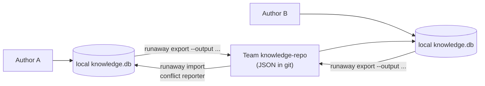

**Who:** 2 to 5 collaborators sharing one install — whether that's a codebase, an internal AI orchestration, an enterprise workflow, or a customer-service knowledge base.

**What's on:** T2 plus author attribution on every write, git-based JSON export/import, a conflict reporter that surfaces row-level differences for human resolution, and opt-in `author_display`.

**What's off:** enforced ACLs, SSO, federation, multi-tenant rollout, audit log governance.

**Resource budget:** per-user same as T2; +50 MB disk for the knowledge-repo working copy.

**Promotion gate to T4:** team has resolved ≥5 import conflicts via the documented workflow, designated ≥1 `runaway_admin`, and operated under T3 for 30 days.

**Rollback:** demote to T2 by dropping the knowledge-repo and reverting config. Lessons exported to the team repo remain in the local DB.

</details>

<details>
<summary><strong>T4 — Team</strong> &nbsp;—&nbsp; 5–20 users with an established review process.</summary>

<br>

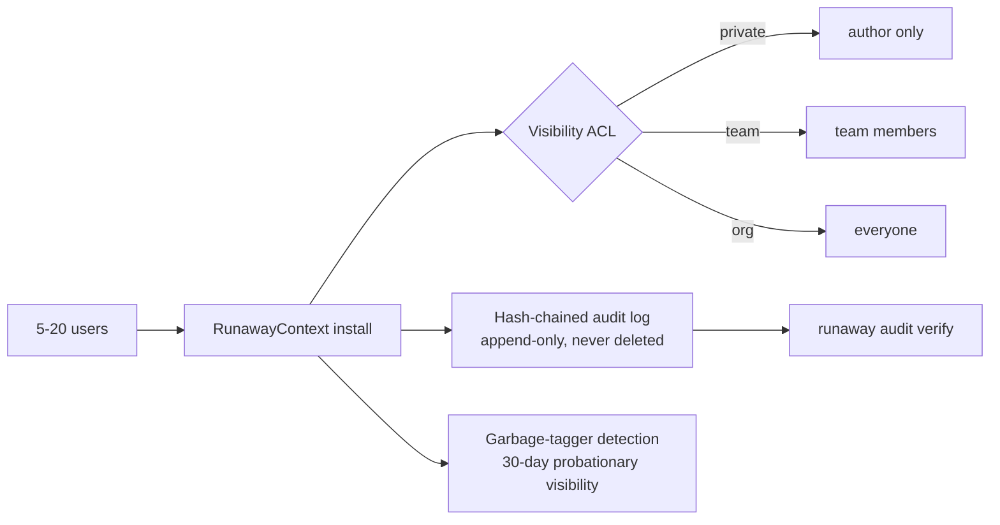

**Who:** 5 to 20 users with an established review process.

**What's on:** T3 plus visibility ACLs (`private` / `team` / `org` enforced in retrieval), promotion gates, multi-tenant rollout helpers, onboarding script, 30-day probationary visibility for new authors, garbage-tagger detection, hash-chained append-only audit log (HR-7), knowledge-repo CI templates.

**What's off:** federation, SSO, OTLP export, air-gapped install.

**Resource budget:** per-user same as T2/T3; +200 MB disk for audit log + governance state.

**Promotion gate to T5:** SSO provider is configured AND a federation source is identified AND the audit log has verified clean (`runaway audit verify`) for 30 consecutive days.

**Rollback:** demote to T3. Visibility ACLs become advisory (filtered out of retrieval but still in DB).

</details>

<details>
<summary><strong>T5 — Org / Enterprise</strong> &nbsp;—&nbsp; 20+ users across teams, SSO-bound, federated sources.</summary>

<br>

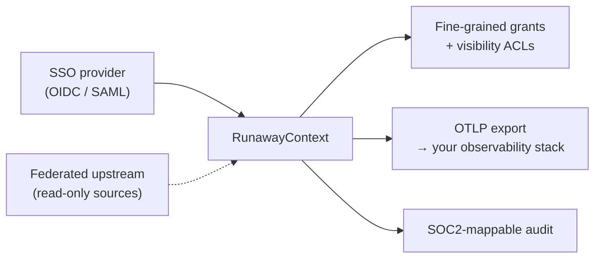

**Who:** organizations of 20+ users across teams.

**What's on:** T4 plus federation (read-only upstream sources), SSO / identity bindings, OpenTelemetry export (opt-in), fine-grained grants, SLO instrumentation.

**What's off:** public sharing. RunawayContext stays self-hosted at every tier, by design.

**Resource budget:** per-user same as T4; org-wide shared DB ~5 GB at 50 users; OTLP egress configurable.

**Promotion gate:** N/A — T5 is the top.

**Rollback:** demote to T4. Federation sources stay in the DB but refresh stops; SSO bindings stay but provider integration disabled.

**Important:** SSO, federation, OTLP export, fine-grained grants, compliance scripts, multi-tenant rollout, importers, dashboards, and cross-platform installers are **spec-only** in this release. We ship the contracts (`docs/specs/*.md`); adopters' AIs implement against their stack. See [the AI-native OSS model](#whats-in-the-box).

</details>

---

## Pick a tier

Most adopters belong at **T1 or T2.** Don't over-pick — promotion is one command (`runaway tier promote --to T<n>`) when your situation outgrows the current rung.

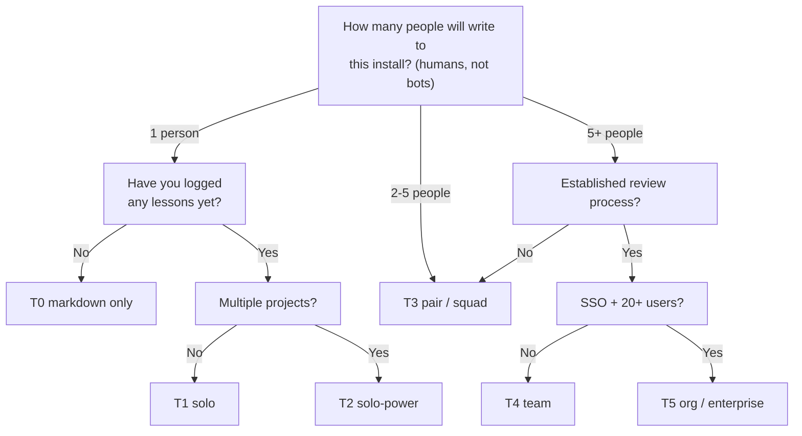

The `runaway init` wizard walks this tree automatically — your AI can answer on your behalf and explain its reasoning.

---

## Install — your AI does it

You paste a prompt; your AI does the work. The full procedure is in [INSTALL_PROMPT.md](INSTALL_PROMPT.md); the loop looks like this:

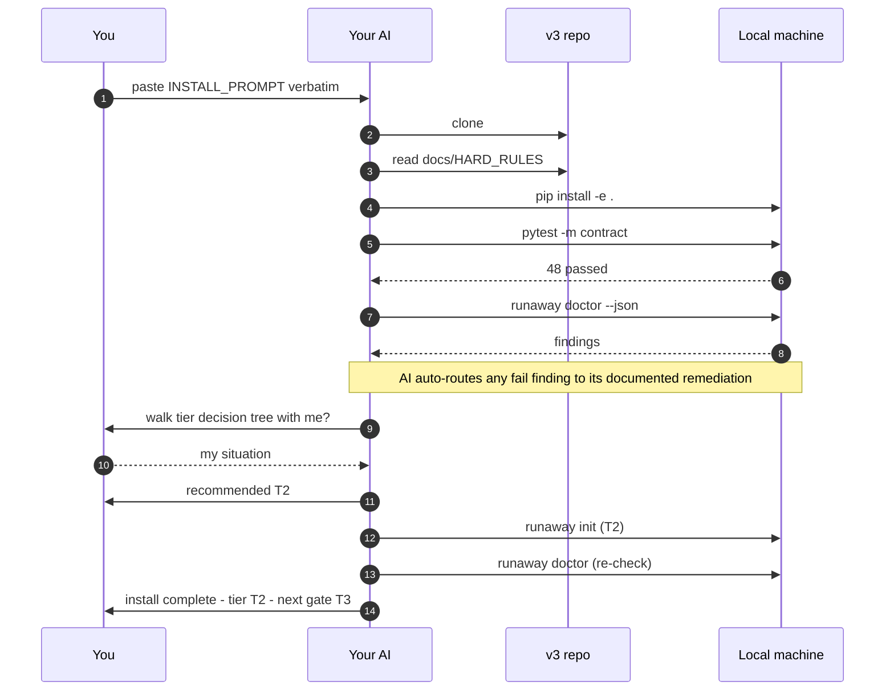

**Three drop-in prompts** ship in [INSTALL_PROMPT.md](INSTALL_PROMPT.md):

1. **Canonical** — for fresh installs.
2. **v2 upgrade** — for adopters with an existing v2 `knowledge.db` + `sessions.db` layout.
3. **v1 upgrade** — for adopters with a v1 single-file `sessions.db`.

All three honor HR-4 (migration is non-destructive). The migrator backs up before touching anything, runs `PRAGMA table_info()` before and after each step, and aborts + restores from backup if any column or row would be lost. **v1 users get a direct one-step path** — no v1 → v2 → v3 detour required.

What you get on completion: your chosen tier, the path to the next promotion gate, any optional warnings you explicitly accepted, and an `install_manifest.json` recording exactly what the install touched. The manifest is the source of truth for the [undo path](#dont-like-it-the-undo-path).

---

## Don't like it? The undo path

Nothing about RunawayContext is one-way. You can leave at any time.

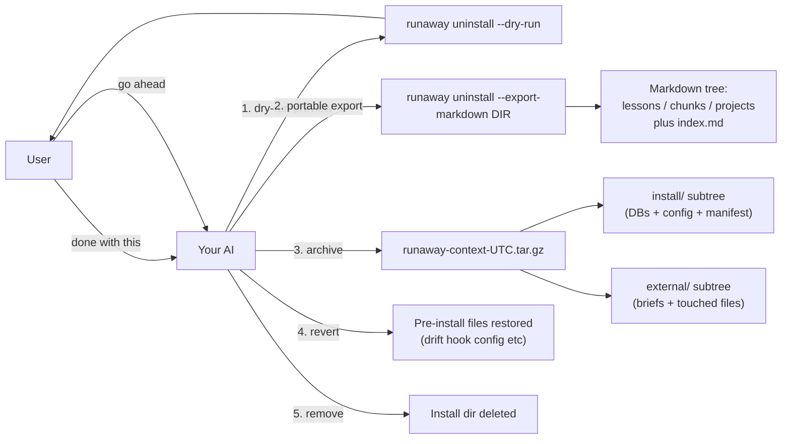

What `runaway uninstall` does, in order:

1. **(optional) Markdown export.** Pass `--export-markdown <DIR>` and every lesson, chunk, and project brief is dumped to a portable `.md` tree with YAML frontmatter. You keep using these files directly with any AI tool — no DB needed.
2. **Archive.** Unless you pass `--no-archive`, the **entire v3 footprint** is snapshotted to a timestamped tarball: the install dir, every project brief v3 wrote at user-controlled paths, every pre-install file v3 modified. A top-level `EXTERNAL_FILES.json` index lists what was where. System roots (`/etc`, `/usr`, etc.) are blocked from the sweep.
3. **(optional) Revert.** Pass `--revert` and any pre-install files the install touched (drift hook config, etc.) are restored to their original content from the install manifest.
4. **Remove.** The install dir is deleted. Pass `--keep-db` to remove only the v3 config and keep the DBs in place.

Untar later to restore exactly. Or never untar — you've still got the portable markdown export. **The fallback is kind by design.**

---

## The 15 hard rules

Every rule has a named test. Every test must pass for the release to ship. No "should." Only "must."

| # | Rule | Enforced by |
|---|---|---|
| **HR-1** | No network egress by default, ever, at any tier | `test_hr_01_no_network_imports`, runtime `Client._hr1_self_check` |
| **HR-2** | Every write is project-tagged at the boundary | SQL triggers + `Client._guard_write` + `test_hr_02_*` |
| **HR-3** | All writes are recoverable (soft delete only) | No-hard-delete schema triggers + `test_hr_03_*` |
| **HR-4** | Migration is non-destructive (ADD COLUMN only) | Migrator pre/post column verification + `test_hr_04_*` |
| **HR-5** | Tier budgets enforced in code, not policy | `md_writer.write_brief()` raises `BriefBudgetExceeded` |
| **HR-6** | Author identity is opaque | Schema `CHECK` constraints + email-regex triggers |
| **HR-7** | Audit log is append-only and chain-verifiable | `audit_log_no_update` / `audit_log_no_delete` triggers + chain verifier |
| **HR-8** | Telemetry never blocks, never raises | `metrics.emit()` wraps every body in try/except + 10K-call <100ms test |
| **HR-9** | Maturation transitions require explicit approval | Engine writes only to `suggested_maturity`; `Client.mature_lesson` is the only path that mutates `maturity` |
| **HR-10** | No silent failures | Lint rule + grep enforcer; permitted narrow exceptions explicitly documented |
| **HR-11** | No deferred work in the shipped plan | `test_hr_11_plan_status_complete` parses the plan and fails on any `pending` / `in_progress` at the release gate |
| **HR-12** | No tests, no merge | Coverage threshold ≥85% + per-public-method test coverage check |
| **HR-13** | No TODO/FIXME/HACK/XXX in shipping code | Pre-commit hook + CI grep |
| **HR-14** | Contracts are documented and machine-readable | `test_hr_14_public_api_documented` checks every public symbol for a docstring with `Returns:` + `Raises:` / `Refuses:` |
| **HR-15** | The reference works end-to-end on a clean machine | Docker-based `test_hr_15_docker_clean_install` |

Full text + per-rule violation handlers: [docs/HARD_RULES.md](docs/HARD_RULES.md).

---

## What's in the box

```
RunawayContext_v3/
├── README.md                         ← you are here
├── INSTALL_PROMPT.md                 ← paste this to your AI
├── RUNAWAYCONTEXT.md                 ← full theory + reference (~700 lines)
├── BOOTSTRAP.md                      ← manual walkthrough of every tier
├── RETRIEVAL.md                      ← paste-once T0 template
├── MIGRATION_V2_TO_V3.md             ← end-to-end upgrade walkthrough
├── CHANGELOG.md                      ← v1 → v2 → v3 history
├── Dockerfile                        ← reference clean-install image (HR-15)
├── pyproject.toml                    ← Python 3.8+, stdlib-only by default
├── schema/                           ← 5 SQL files; HR-4 additive
├── src/runaway_context/              ← 14.5K lines; 44 modules
│   ├── client.py                     ← Client class (32 public methods)
│   ├── mcp_server.py                 ← 13-tool MCP server (Content-Length stdio)
│   ├── cli.py                        ← 28-subcommand `runaway` dispatcher
│   ├── doctor.py                     ← `runaway doctor` diagnostics
│   ├── init.py                       ← `runaway init` wizard + tier recommender
│   ├── uninstall.py                  ← `runaway uninstall` (archive + export + revert)
│   ├── migrate.py                    ← v1 / v2 / fresh → v3 migrator (HR-4)
│   ├── audit.py                      ← hash-chained audit log + verifier
│   ├── maturation.py                 ← six-state lifecycle engine (HR-9)
│   └── ...                           ← 35 more modules
├── tests/                            ← 575 tests; 86% coverage
│   ├── contract/                     ← HR-1..HR-15 + anti-loopholes
│   └── unit/                         ← per-feature E1–E24 + provider mocks
├── docs/
│   ├── HARD_RULES.md                 ← the charter
│   ├── ARCHITECTURE.md               ← mermaid diagrams + principle map
│   ├── MCP.md                        ← all 13 MCP tools
│   ├── PYTHON_API.md                 ← Client class reference
│   └── specs/                        ← 10 spec-only artifacts (S1-S10)
│       ├── SSO_INTEGRATION.md        ← adopters' AIs implement against these
│       ├── FEDERATION.md
│       ├── OTLP_EXPORT.md
│       ├── AIR_GAPPED_INSTALL.md
│       ├── FINE_GRAINED_GRANTS.md
│       ├── COMPLIANCE.md
│       ├── MULTI_TENANT_ROLLOUT.md
│       ├── IMPORTERS.md
│       ├── DASHBOARD.md
│       └── CROSS_PLATFORM.md
├── templates/                        ← 7 work-type starter templates
├── bin/                              ← 9 shell scripts (drift hooks, backups, hygiene)
├── docker/                           ← clean-install verification scripts
└── .github/workflows/ci.yml          ← contract + clean-install + release gate
```

### The AI-native OSS model

This release ships **principles + schema + reference implementation + rules with tests**. It does **not** ship turnkey integrations to every imaginable stack — SSO bindings, federation backends, OTLP exporters, FastAPI dashboards, Windows installers. Those are intentionally spec-only.

**Adopters bring an AI**; that AI reads the principles, the schema, the reference, the tests. It adapts the framework to its local environment, debugs install issues against the local machine, and writes the integration code against the local stack. We supply the model and the principles; the adopter's AI puts them into action.

The result: a small, focused reference implementation we can actually maintain — and an unbounded set of conforming integrations adopters' AIs build for their environments.

---

## Quick start

### A) Fresh machine

```
Paste this to your AI:

I want to install RunawayContext v3 from https://github.com/sms021/RunawayContext
on this machine. Follow the procedure in INSTALL_PROMPT.md exactly. Do not skip
steps. Do not silence failing contract tests.
```

Your AI clones, installs, runs the 48 contract tests, runs `runaway doctor`, walks the tier decision tree with you, and reports. Total time: ~5 minutes.

### B) Existing v2 install

```
Paste this to your AI:

I have RunawayContext v2 at ~/_knowledge on this machine. Upgrade to v3 from
https://github.com/sms021/RunawayContext following the "Already have v2?"
section of INSTALL_PROMPT.md. Confirm row counts before and after.
```

The migrator is additive (HR-4). Every v2 row, column, and table is preserved. New v3 columns/tables are added on top.

### C) Existing v1 install

```
Paste this to your AI:

I have RunawayContext v1 at ~/_knowledge on this machine (one .db file with
everything in it). Upgrade to v3 directly — no v1→v2→v3 detour — following
the "Already have v1?" section of INSTALL_PROMPT.md.
```

The migrator auto-detects v1, copies transcripts into a new `sessions.db` non-destructively (the v1 `sessions` table stays in place), then applies the v3 additive layer.

---

## Works with

### AI coding assistants

| Tool | Integration |
|---|---|
| **Claude Code** (CLI / VS Code) | MCP server via `~/.claude/mcp.json`; Stop hook for drift detection |
| **Cursor** | `.cursor/rules/runaway-retrieval.md` ships in the repo; MCP also supported |
| **GitHub Copilot** | `.github/copilot-instructions.md` populated from project brief |
| **OpenAI Codex CLI** | `AGENTS.md` integration |
| **Aider** | `.aider.conf.yml` + conventions file integration |
| **Windsurf** | `.windsurfrules` integration |

### Custom AI agents, internal automation, enterprise workflows

| Surface | How |
|---|---|
| **Python in-process** | `from runaway_context import Client; c = Client(); c.log_lesson(...)`. Use this in custom agents, scheduled jobs, queue consumers, FastAPI endpoints, anywhere Python imports the library. |
| **Subprocess / shell** | `runaway log-lesson ...`, `runaway search ...`, `runaway brief <project>`. Use this from n8n nodes, Temporal activities, bash scripts, cron jobs, GitHub Actions, anywhere a subprocess is cleaner than linking the library. |
| **MCP stdio** | `runaway mcp serve`. Use this from any client that speaks JSON-RPC 2.0 + Content-Length framing — coding tools that support MCP, but also any custom orchestration framework that wants the same 13-tool surface a coding assistant gets. |
| **Markdown-only** | Briefs auto-write to `<project>/CLAUDE.md` (or any path you configure). Any agent that reads a markdown file gets the project's top warnings + active lessons for free. |

For tools without Stop hooks, the cron-based `bin/md_drift_watcher.sh` handles drift detection independently.

---

## Key principles

- **Route, don't dump.** Different knowledge belongs at different depths. Business rules go in project briefs, not the Constitution.
- **Budget every tier.** Constitution ≤ 200 lines. Living Memory ≤ 50 lines (pointer-only). Project briefs ≤ 150 lines. The regenerator enforces these constraints in code (HR-5).
- **Earn your place.** Knowledge enters Living Memory only after proving it prevents real mistakes. Lessons have severity, maturity, and status — they evolve.
- **Decay, don't hoard.** `maturity='internalized'` retires lessons from briefs but keeps them queryable. Drift detection surfaces bloat the moment it appears.
- **Tag at the write.** Every chunk and lesson is project-tagged. Typos can't sneak in. The slug registry is the install's source of truth for project names (HR-2).
- **Session continuity.** Every conversation is logged. Lessons cite their source session via `conversation_id`. `ATTACH sessions.db` at query time to drill in.
- **No silent failures.** Every failure surfaces to the caller (HR-10). The system fails loudly when something is wrong.

---

## Background

This system was developed over hundreds of real-world sessions building enterprise integrations and an in-house AI orchestration agent. v2's enforcement-first design came from watching v1's policy-only constraints quietly drift over six months of daily use. v3 added a named test to every rule because v2's enforcement still leaked when the docs left ambiguous edges. The rules hold themselves now — drift is detectable; loopholes are closed by construction.

Influences:
- Academic work on codified context in LLM-assisted development.
- Open-source projects: Mem0, OpenMemory, Brain-Agent.
- Industry practice: Manus context engineering, Spotify, OpenAI Codex.
- Hard-won lessons from daily multi-project, multi-user AI workflows.

Full research notes and references: [RUNAWAYCONTEXT.md](RUNAWAYCONTEXT.md).

---

## License

[MIT](LICENSE) — use it however you want. Free, forever, no strings.

If RunawayContext saves you time or tokens, and you'd like to chip in toward continued development, donations are welcome at **[runawayideas.net/donate](https://runawayideas.net/donate)**. Entirely optional — there is no paid tier and no "premium" of anything. The whole project is and stays MIT.

---

<div align="center">

**Small surface. Tested rules. Honest memory.**

Made by [Runaway Ideas](https://github.com/sms021).

</div>
