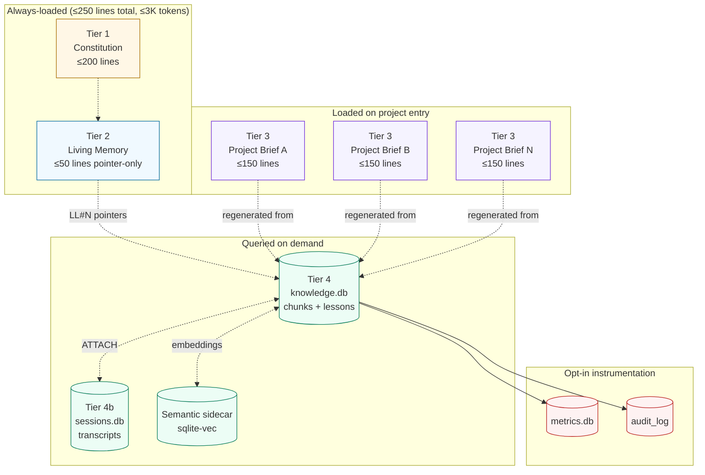
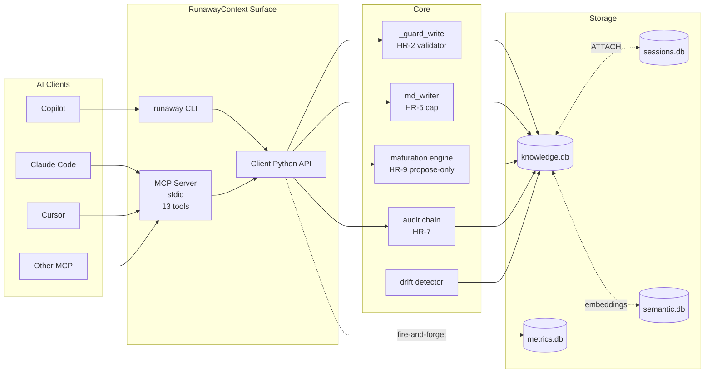
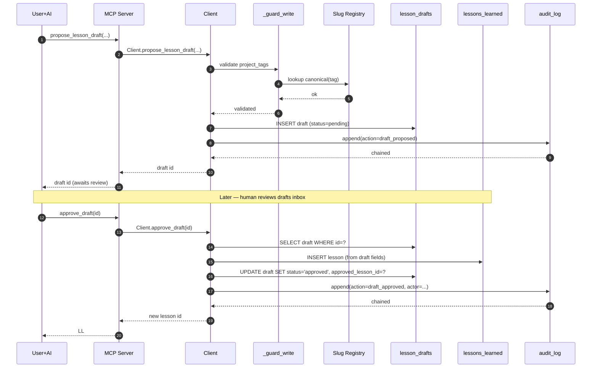
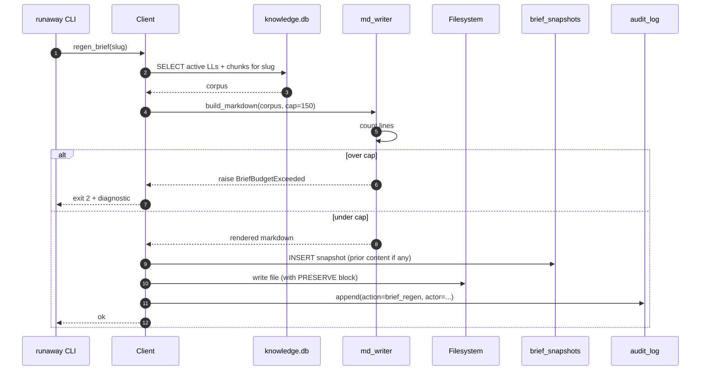
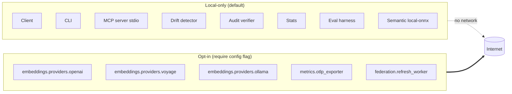
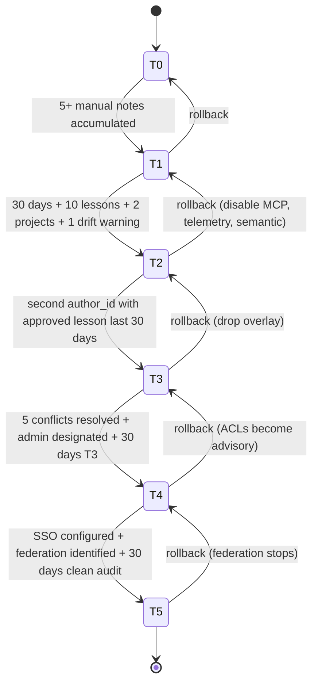

# Architecture

This document maps the architecture of RunawayContext v3 from the top-level tier diagram down to the principle-to-enforcement table that ties each pillar (P1..P7) to its hard rule (HR-1..HR-15) and the test file that enforces it.

---

## Tier Architecture

Every tier has:
- **A budget** enforced in code (HR-5).
- **A write-time validator** that refuses untagged content (HR-2).
- **A recoverable-only delete path** (HR-3).
- **A network-egress invariant** (HR-1) — every tier is local by default.

---

## Component Architecture

The Client API is the single source of writes. The CLI, MCP server, and any external tooling go through it. The triggers at the SQL layer are the secondary guard; if any code path bypasses the Client (intentionally or accidentally), the triggers reject the write.

---

## Principle → Enforcement Map

| Pillar | Principle | Hard rule | Code enforcer | Test file |
|---|---|---|---|---|
| **P1** | Local-First by Physics | HR-1 | Allowlisted import test + runtime module-graph walk in `Client.__init__` | `tests/contract/test_hr_1_no_network.py` |
| **P2** | Budgets Enforced in Code | HR-5 | `md_writer.write_brief()` line-count gate | `tests/contract/test_hr_5_regenerator_refuses_overflow.py` |
| **P3** | Tag at the Write | HR-2 | SQLite triggers + `Client._guard_write()` | `tests/contract/test_hr_2_writes_require_valid_slug.py` |
| **P4** | Lifecycle-Aware Knowledge | HR-9 | Maturation engine writes `suggested_maturity` only; `Client.mature_lesson()` is the sole approval path | `tests/contract/test_hr_9_maturation_no_auto_apply.py` |
| **P5** | Tier-Progressive Scaling | HR-5 (budgets) + tier gates | `runaway tier check` reads schema_version + feature flags; `runaway tier promote --check` runs the gate | `tests/unit/test_tier_gates.py` |
| **P6** | Measurement-Driven Evolution | HR-8 + HR-12 | `metrics.emit()` is fire-and-forget; eval harness drives retrieval decisions | `tests/contract/test_hr_8_emit_never_raises.py`, `test_hr_8_emit_never_blocks.py` |
| **P7** | Discipline Over Convenience | HR-10, HR-11, HR-13 | Lint rules + plan parser + grep | `tests/contract/test_hr_10_no_silent_except.py`, `test_hr_11_plan_status_complete.py`, `test_hr_13_no_todo_in_release.py` |

Additional cross-cutting contracts:

| Rule | Code enforcer | Test file |
|---|---|---|
| **HR-3** All writes recoverable | `Client.soft_delete()` + `record_versions` table; admin-only `hard-delete` CLI | `tests/contract/test_hr_3_no_hard_delete_paths.py` |
| **HR-4** Migration non-destructive | Migrator's `PRAGMA table_info()` before/after diff; abort-and-restore on column loss | `tests/contract/test_hr_4_migration_preserves_v2_surface.py` |
| **HR-6** Author identity opaque | Schema CHECK + author trigger | `tests/contract/test_hr_6_author_id_no_pii.py` |
| **HR-7** Audit log unbreakable | Triggers `audit_log_no_update`, `audit_log_no_delete` + chain verifier | `tests/contract/test_hr_7_audit_chain_unbreakable.py` |
| **HR-12** No tests no merge | CI coverage gate + public API introspection | `tests/contract/test_hr_12_public_api_coverage.py` |
| **HR-14** Contracts documented | Docstring introspection | `tests/contract/test_hr_14_public_api_documented.py` |
| **HR-15** Clean install works | Docker sandbox test | `tests/contract/test_hr_15_clean_install_works.py` |

---

## Data Flow: A New Lesson

Key invariants in this flow:

- The draft is tagged before INSERT (HR-2). If the slug is invalid, the draft never enters the table.
- The approval path is the only path that writes to `lessons_learned`. The maturation engine cannot promote a draft to a real lesson.
- Both the proposal and the approval are recorded in the audit log (HR-7). Tampering with either is detectable.
- The draft is never deleted — its status moves from `pending` to `approved` / `rejected` / `merged`, preserving the history.

---

## Data Flow: Brief Regeneration

The writer refuses overflow at line-count time, before any file write. Snapshots are taken on every regen (E20) so `brief_rollback` is always available.

---

## Network Boundary

The boundary is enforced at three levels:

1. **Build-time:** `tests/contract/test_hr_1_no_network.py` greps every module under `src/runaway_context/` for `socket`, `http`, `urllib`, `requests`, `httpx`, `aiohttp`. Non-allowlisted matches fail the build.
2. **Runtime:** `Client.__init__` walks the loaded module graph and refuses to start if any non-allowlisted network-capable module is loaded without its corresponding config flag set.
3. **Configuration:** Each opt-in module requires both a config flag and explicit user consent. The flags are not silently honored — they appear in `runaway config show`.

---

## File Layout Conventions

| Path | Contents | Constraint |
|---|---|---|
| `src/runaway_context/` | Core Python package | HR-1 import allowlist |
| `src/runaway_context/embeddings/providers/` | Embedding backends | Opt-in modules allowlisted |
| `src/runaway_context/metrics/` | Telemetry | `otlp_exporter` is opt-in |
| `src/runaway_context/federation/` | Federation worker | Opt-in only |
| `src/runaway_context/mcp_server/` | MCP stdio server | Local-only by transport |
| `schema/` | SQL migrations | Additive-only (HR-4) |
| `tests/contract/` | HR-* contract tests | No `@pytest.mark.skip` |
| `tests/unit/` | Per-feature tests | ≥85% coverage |
| `tests/fixtures/` | Frozen DBs for migration tests | v1, v2-clean, v2-with-data |
| `bin/` | Shell helpers, drift detector | No silent failures |
| `templates/` | Work-type templates | T0 capability |
| `docs/specs/` | Adopter specs S1..S10 | No implementation in src/ |
| `skills/runaway-context/` | Claude Code skill | Auto-loaded |
| `.cursor/rules/` | Cursor rule pointer | References MCP |

---

## Promotion Gate Architecture

Each transition has:
- A machine-checkable gate (`runaway tier promote --to TN --check`).
- A documented rollback contract (per [RUNAWAYCONTEXT.md §Tier Ladder](../RUNAWAYCONTEXT.md#the-six-rung-ladder-t0t5)).
- Audit log entries on every transition.

---

## Cross-References

- The hard rules themselves: [HARD_RULES.md](HARD_RULES.md).
- The full theory and reference guide: [RUNAWAYCONTEXT.md](../RUNAWAYCONTEXT.md).
- The MCP surface: [MCP.md](MCP.md).
- The Python Client API: [PYTHON_API.md](PYTHON_API.md).
- The bootstrap walkthrough: [BOOTSTRAP.md](../BOOTSTRAP.md).
- The v2 → v3 migration: [MIGRATION_V2_TO_V3.md](../MIGRATION_V2_TO_V3.md).
- The adopter specs: [specs/](specs/) — S1 through S10.
