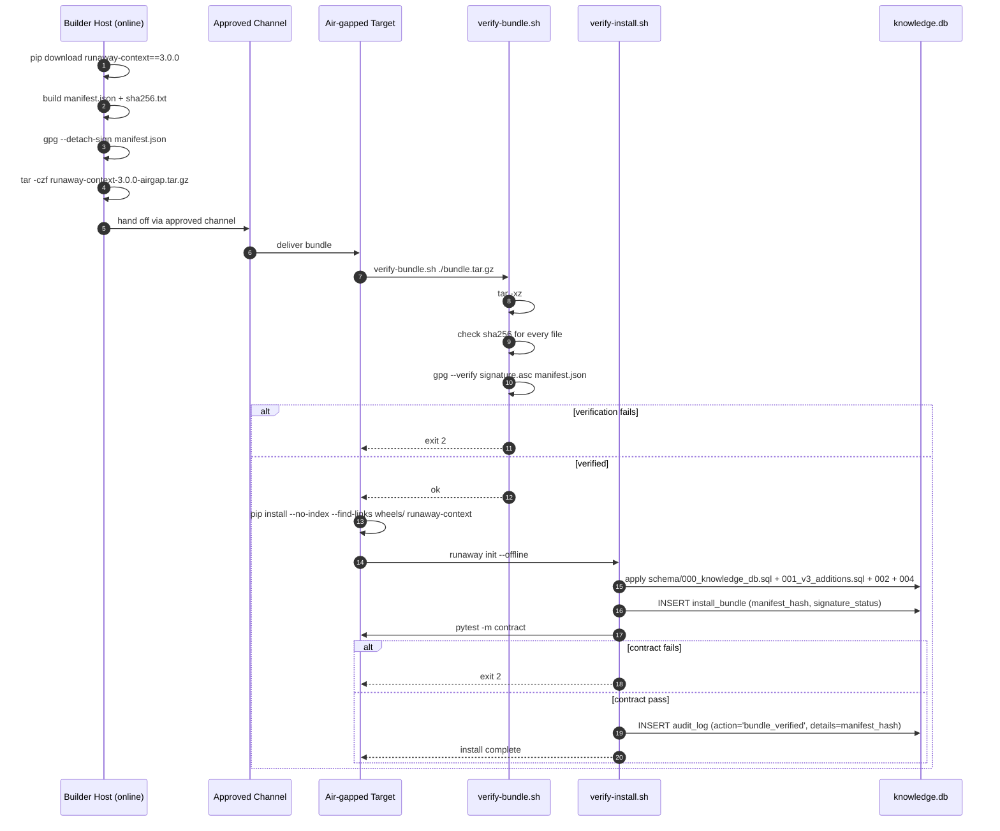

# S4 — Air-Gapped Install

> *This specification defines the contract. Implementations must pass the contract tests (named below). Implementations that pass the contract tests are conforming. Implementations that do not are not. There is no "partial conformance." There is no "spirit of the contract." The contract tests are the contract.*

## What this spec replaces

Previously planned: a pre-built air-gapped bundle shipped from the maintainer. v3 instead ships the contract for the bundle's composition and verification. Adopters who need to install on a network-isolated machine build the bundle on a connected machine that mirrors the install target, transfer it over an approved channel, and verify on the air-gapped host.

This is the natural extension of HR-1: if the default install makes zero network calls, then an air-gapped install is just the default install with the *transfer* mechanism formalized.

## 1. Integration Contract

### Inputs

| Input | Source | Shape |
|---|---|---|
| `bundle.tar.gz` | Built on connected mirror host | Tarball with manifest + payload |
| `manifest.json` | Inside bundle | Schema below |
| `sha256.txt` | Inside bundle | Per-file SHA256 |
| `signature` | Inside bundle (optional) | GPG or minisign of the manifest |

### Bundle composition

The bundle MUST contain:

```
runaway-context-3.0.0-airgap/
├── manifest.json              # bundle metadata + file list with hashes
├── sha256.txt                 # plain "<sha256>  <relative path>" lines
├── signature.asc              # detached signature of manifest.json (optional)
├── wheels/                    # all Python wheels needed by the install
│   ├── runaway_context-3.0.0-py3-none-any.whl
│   └── <every direct + transitive dependency>.whl
├── schema/                    # SQL migrations
├── templates/                 # work-type templates
├── docs/                      # rendered docs
├── tests/                     # contract tests + fixtures
├── checks/
│   ├── verify-install.sh      # local verification script
│   └── verify-bundle.sh       # bundle integrity check
└── INSTALL.md                 # offline install instructions
```

### Outputs

| Output | Effect |
|---|---|
| A working RunawayContext install on the air-gapped host | All contract tests pass |
| A `bundle_verification` audit log entry | Evidence the bundle was verified |

### Invariants

1. **HR-1.** The verification script makes zero network calls. The install procedure makes zero network calls. The contract test suite runs without network.
2. **HR-4.** Migrations from older airgapped bundles to newer ones are non-destructive.
3. **HR-7.** The bundle's verification is audit-logged. The audit log entry includes the bundle's manifest hash.
4. **HR-13.** No TODO/FIXME in the bundle's verification scripts.
5. **HR-15.** The bundle MUST install end-to-end on a clean machine. The `test_airgap_clean_install` test runs in a Docker container with no network.

### Refusal contract

The installer MUST refuse to proceed if:

- `manifest.json` is missing or malformed.
- Any file's hash does not match `sha256.txt`.
- The signature does not verify against a configured trusted pubkey (when signature checking is enabled).
- The Python version on the target does not satisfy `requires-python`.
- The SQLite version does not include FTS5.

## 2. Schema Additions

```sql
CREATE TABLE IF NOT EXISTS install_bundle (
    id INTEGER PRIMARY KEY CHECK (id = 1),
    bundle_version TEXT NOT NULL,
    bundle_manifest_hash TEXT NOT NULL,
    bundle_verified_at DATETIME,
    bundle_signature_status TEXT
        CHECK (bundle_signature_status IN ('unsigned', 'verified', 'unverified', 'invalid')),
    install_completed_at DATETIME
);
```

This row records the provenance of the bundle that produced the install. At each upgrade, a new row is appended (the table effectively becomes append-only via `id` schema; for v3 we use a single-row design with a history view).

The bundle's manifest hash is also written to `audit_log` as a `bundle_verified` event when verification completes.

## 3. Reference Flow



## 4. Contract Tests

Located under `tests/spec/air_gapped/`:

| Test | Asserts |
|---|---|
| `test_airgap_bundle_manifest_complete` | The manifest lists every file in the bundle; no extraneous files; no missing files |
| `test_airgap_sha256_matches` | Every file's actual hash matches its entry in `sha256.txt` |
| `test_airgap_signature_optional_but_correct` | If signature is present and verification is enabled, it verifies; if not present and verification is enabled, install refuses |
| `test_airgap_no_network_during_install` | The install script (`verify-install.sh`) makes zero network calls (HR-1, verified by network namespace isolation in test) |
| `test_airgap_clean_install` | In a Docker container with no network, the bundle installs and all contract tests pass (HR-15) |
| `test_airgap_python_version_check` | Install refuses if Python version is unsupported |
| `test_airgap_sqlite_fts5_check` | Install refuses if SQLite lacks FTS5 |
| `test_airgap_audit_logs_bundle_verification` | After install, `audit_log` has a `bundle_verified` row with the manifest hash (HR-7) |
| `test_airgap_records_install_bundle` | `install_bundle` table has a row with the correct version + hash |
| `test_airgap_docstrings_complete` | Verification scripts (or their Python equivalents) document `Returns:`, `Raises:`, `Refuses:` (HR-14) |

## 5. Anti-Loophole Notes

The adopter's AI MUST NOT:

- **Skip signature verification "just for this install."** If signatures are enabled in policy, they are enabled for every install. The escape is to disable in config explicitly with a documented justification.
- **Run the contract test suite over the network just to "save time."** Air-gapped is air-gapped. The Docker test runs without network and proves the bundle is self-contained.
- **Include `pip install` calls that reach an index.** All wheels MUST be in `wheels/`. The install uses `--no-index --find-links wheels/`.
- **Skip the SHA verification "because the bundle just came over."** Files in transit can be corrupted; HR-4 forbids destruction; verifying SHAs is the defense.
- **Embed PII in the bundle.** No usernames, no hostnames, no email addresses in the manifest or any file. Per HR-6.
- **Auto-update on first run.** The whole point of air-gapped is no surprise network. The bundle installs exactly what is in the bundle; updates require a new bundle.

## Verification

```bash
# On the air-gapped target
./checks/verify-bundle.sh ./runaway-context-3.0.0-airgap.tar.gz
# expected: "bundle ok"

./checks/verify-install.sh
# expected: "install ok, contract tests pass"

runaway tier check          # works
runaway audit verify        # passes
runaway config show --network
# expected: "network egress: disabled (HR-1)"

pytest -m contract -v       # all pass
```
