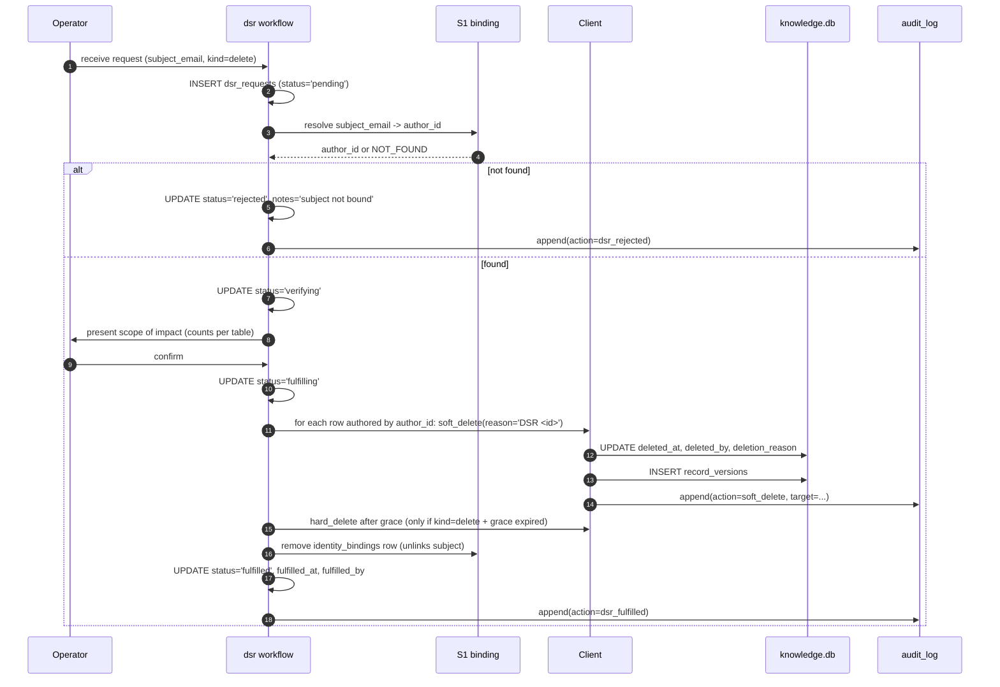

# S6 — Compliance (SOC2 + GDPR)

> *This specification defines the contract. Implementations must pass the contract tests (named below). Implementations that pass the contract tests are conforming. Implementations that do not are not. There is no "partial conformance." There is no "spirit of the contract." The contract tests are the contract.*

## What this spec replaces

Previously planned: shipped SOC2 / GDPR compliance documentation, retention policies, and request-handling workflows. v3 instead ships the contract for how compliance attaches to the install. Adopters' AIs build the specific control documents, retention policies, and DSR (Data Subject Request) workflows that fit their organization's compliance posture.

The framework provides the *mechanism* (audit log per HR-7, soft-delete per HR-3, opaque identity per HR-6, network egress controls per HR-1). The adopter wires those mechanisms to their compliance program.

## 1. Integration Contract

### Inputs

| Input | Source | Shape |
|---|---|---|
| `retention_policy` | Config | per-table maximum age for soft-deleted rows |
| `dsr_request` | External system (ticket, email, etc.) | Subject identifier + request kind |
| `control_attestation_schedule` | Config | how often to run + persist control evidence |
| `incident_kind` | Operator | type of compliance event |

### Outputs

| Output | Effect |
|---|---|
| Retention sweeper purges rows past policy (with audit) | Compliance with retention policies |
| DSR workflow produces export OR redaction OR deletion (with audit) | Compliance with subject-access / right-to-be-forgotten |
| Control evidence rows accumulate over time | Auditable trail for SOC2 attestation |

### Invariants

1. **HR-3.** Even compliance purges go through the recoverable-write path. The retention sweeper soft-deletes for a configurable grace period before any hard-delete. Hard-delete during a DSR fulfillment uses the audited admin escape (`runaway db hard-delete --i-understand-this-is-permanent --backup-first`).
2. **HR-6.** DSRs map a real subject (an email address, an employee id) to an opaque `author_id` via the SSO binding (S1's `identity_bindings`). The mapping is the only place the real subject and the `author_id` touch; redacting one redacts the other.
3. **HR-7.** Every compliance action is audit-logged: retention sweeps (with row counts), DSR requests, fulfillments, attestation runs.
4. **HR-10.** A DSR that fails partway must not leave the install in an inconsistent state. The workflow uses transactions; on failure it rolls back and reports.
5. **HR-13.** Compliance scripts contain no TODO/FIXME.

### Refusal contract

The retention sweeper MUST refuse to run if:

- The configured policy is missing or unparseable.
- The grace period is zero (refuses to purge without grace — a sanity guard).
- The audit chain is broken at startup (HR-7 — must remediate first).

The DSR workflow MUST refuse a fulfillment if:

- The subject's identity binding cannot be resolved.
- The requested kind is unrecognized.
- The operator has not provided the appropriate authorization for `delete`-kind requests.

## 2. Schema Additions

```sql
CREATE TABLE IF NOT EXISTS retention_policies (
    id INTEGER PRIMARY KEY AUTOINCREMENT,
    target_table TEXT NOT NULL
        CHECK (target_table IN ('knowledge_chunks', 'lessons_learned', 'lesson_drafts',
                                'session_logs', 'metrics_events')),
    max_age_days INTEGER NOT NULL,
    soft_delete_grace_days INTEGER NOT NULL DEFAULT 90,
    enabled INTEGER DEFAULT 1,
    last_sweep_at DATETIME,
    last_sweep_purged_count INTEGER DEFAULT 0
);

CREATE TABLE IF NOT EXISTS dsr_requests (
    id INTEGER PRIMARY KEY AUTOINCREMENT,
    received_at DATETIME DEFAULT CURRENT_TIMESTAMP,
    received_by TEXT,
    subject_identifier TEXT NOT NULL,
    subject_author_id TEXT,
    request_kind TEXT NOT NULL CHECK (request_kind IN ('export', 'redact', 'delete')),
    status TEXT DEFAULT 'pending'
        CHECK (status IN ('pending', 'verifying', 'fulfilling', 'fulfilled', 'rejected', 'partial')),
    fulfilled_at DATETIME,
    fulfilled_by TEXT,
    notes TEXT,
    artifact_path TEXT       -- export artifact location, if applicable
);

CREATE TABLE IF NOT EXISTS control_evidence (
    id INTEGER PRIMARY KEY AUTOINCREMENT,
    control_id TEXT NOT NULL,        -- e.g., 'SOC2-CC6.1', 'GDPR-Art-32'
    collected_at DATETIME DEFAULT CURRENT_TIMESTAMP,
    evidence_kind TEXT NOT NULL,     -- 'audit_chain', 'config_snapshot', 'access_review'
    payload TEXT NOT NULL,           -- JSON or text artifact
    payload_hash TEXT NOT NULL,
    collected_by TEXT
);
CREATE INDEX IF NOT EXISTS idx_evidence_control_time ON control_evidence(control_id, collected_at DESC);
```

## 3. Reference Flow — DSR Fulfillment



## 4. Contract Tests

Located under `tests/spec/compliance/`:

| Test | Asserts |
|---|---|
| `test_compliance_retention_sweep_soft_deletes` | Sweep marks rows past `max_age_days` as soft-deleted, not hard-deleted (HR-3) |
| `test_compliance_retention_audited` | Each sweep produces an `audit_log` row with the count purged |
| `test_compliance_retention_zero_grace_refused` | A retention policy with `soft_delete_grace_days = 0` is refused at INSERT (sanity guard) |
| `test_compliance_dsr_export_produces_artifact` | Export-kind DSR produces a JSON file at `artifact_path` containing all rows for the subject |
| `test_compliance_dsr_redact_keeps_audit` | Redact-kind DSR removes content payload but retains the audit chain (HR-7) |
| `test_compliance_dsr_delete_uses_admin_path` | Delete-kind DSR's hard-delete step uses the audited admin escape; both flags present |
| `test_compliance_dsr_unbound_rejected` | DSR for a subject without an `identity_bindings` row is rejected |
| `test_compliance_dsr_fulfilled_logged` | A fulfilled DSR has `audit_log` rows for every soft-delete + the fulfillment record |
| `test_compliance_evidence_hashed` | Every `control_evidence` row's `payload_hash` matches the payload (tamper detection) |
| `test_compliance_chain_break_blocks_sweep` | A broken audit chain at startup prevents the retention sweeper from running |
| `test_compliance_docstrings_complete` | Public methods carry `Returns:`, `Raises:`, `Refuses:` |

## 5. Anti-Loophole Notes

The adopter's AI MUST NOT:

- **Skip the grace period for "urgent" DSR delete requests.** Urgency is the operator's problem to manage with the requestor; the grace period is a recoverability invariant (HR-3). If true emergency, the admin escape exists and is logged.
- **Treat retention as eventual purge.** The sweeper's audit log includes counts and target ids. If the sweeper misses a row (or hits one it shouldn't), the audit chain proves it.
- **Re-link a redacted subject.** Once `identity_bindings` is removed, the `author_id` is orphaned and cannot be rebound. This is intentional.
- **Hash-store the subject email in `dsr_requests`.** The column is plain text because the request itself is operator-handled. The compliance archive of the request is the operator's responsibility, not the framework's.
- **Combine multiple subjects into one DSR.** Each subject is one DSR. Batching violates the audit-trail-per-subject invariant.
- **Sweep telemetry tables silently.** Metrics events that age out should follow the same audit pattern — even though they are high-volume, the sweep summary is auditable.
- **Use DSR fulfillment to "clean up" arbitrary rows.** A DSR is scoped to a subject. Out-of-scope deletions during a DSR run violate the invariant.

## Verification

```bash
pytest tests/spec/compliance/ -v

# Smoke test
runaway retention list
runaway retention sweep --dry-run --policy lessons_learned_2y
runaway retention sweep --policy lessons_learned_2y      # actually runs
runaway audit verify
runaway audit list --action retention_sweep

# DSR
runaway dsr submit --subject user@example.com --kind export
runaway dsr fulfill --id 17
ls dsr_artifacts/                  # export artifact present

# Control evidence
runaway evidence collect --control SOC2-CC6.1
```
