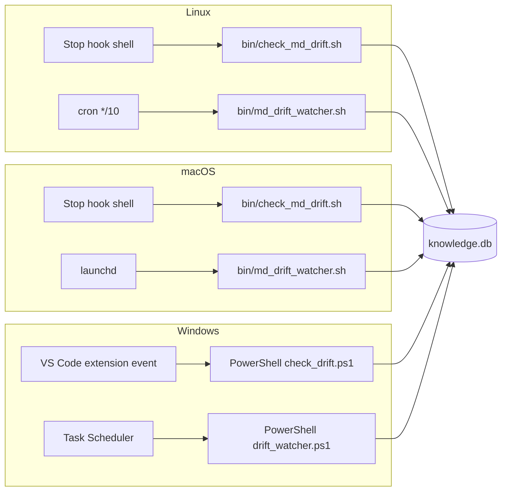

# S10 — Cross-Platform

> *This specification defines the contract. Implementations must pass the contract tests (named below). Implementations that pass the contract tests are conforming. Implementations that do not are not. There is no "partial conformance." There is no "spirit of the contract." The contract tests are the contract.*

## What this spec replaces

Previously planned: full cross-platform testing matrix in CI shipped from the maintainer. v3 ships Linux (x86_64 + ARM64) and macOS as reference platforms; Windows is **adopter-built** against this spec. macOS adaptations beyond the reference are also covered here.

The reference implementation runs on POSIX. Windows requires translation of several POSIX assumptions (shell hooks, signal-driven drift detectors, path separators, file permissions). This spec defines the contract any cross-platform port must honor.

## 1. Integration Contract

### Inputs

| Input | Source | Shape |
|---|---|---|
| `target_platform` | Runtime detect (`platform.system()`) | `Linux` / `Darwin` / `Windows` |
| `tool_paths` | Config | OS-appropriate paths for `~/.claude/`, `~/_knowledge/`, etc. |
| `hook_mechanism` | Config | `stop-hook` (POSIX) / `vsc-extension-event` / `scheduled-task` (Windows) |
| `cron_or_task` | Config | `cron` (Linux) / `launchd` (macOS) / `task-scheduler` (Windows) |

### Outputs

| Output | Effect |
|---|---|
| Drift detector wired to the OS's scheduling primitive | Drift surfaces regardless of OS |
| Stop hooks (where supported) wired equivalently | Same trigger surface |
| File permissions configured per-tenant | HR-6 isolation honored |

### Invariants

1. **HR-1.** Cross-platform builds do not introduce new network calls. The Windows port uses Windows APIs for file watching, not a cloud-mediated alternative.
2. **HR-4.** Migration runs identically on every platform. The schema migrations are pure SQL and are platform-independent.
3. **HR-10.** OS-specific failures (permission errors, file lock contention, registry issues) surface clearly. No silent degradation.
4. **HR-15.** The clean-install test runs on the reference platforms; the spec test suite (`tests/spec/cross_platform/`) runs on the adapted platform.
5. **Path-separator hygiene.** All path manipulation uses `pathlib.Path` (or equivalent). String concatenation of paths is forbidden.

### Refusal contract

A cross-platform port MUST refuse to install if:

- The OS lacks SQLite with FTS5.
- The Python version is below the minimum.
- The OS's scheduling primitive is unavailable AND no alternative drift mechanism is configured.
- The user lacks write permissions to the configured install location.

## 2. Schema Additions

No schema changes are platform-specific. The same `001_v3_additions.sql` applies on every platform. The only platform-specific consideration is the schema-version table, which adopters' AIs may extend with platform metadata if useful:

```sql
ALTER TABLE schema_version ADD COLUMN install_platform TEXT;
ALTER TABLE schema_version ADD COLUMN install_python_version TEXT;
ALTER TABLE schema_version ADD COLUMN install_sqlite_version TEXT;
```

These columns are populated at first install and provide cross-platform diagnostic information.

## 3. Reference Adaptations

### Linux (reference)

- Drift detector: `bin/check_md_drift.sh` invoked via Claude Code Stop hook + cron entry from `bin/md_drift_watcher.sh`.
- Per-user isolation: POSIX permissions + ACLs.
- Backup: `bin/backup_db.sh` via cron.

### macOS

- Drift detector: same shell scripts, scheduled via `launchd` instead of cron. A reference plist lives at `bin/macos/com.runawayideas.runawaycontext.plist`.
- Per-user isolation: POSIX permissions (no SELinux); macOS-specific quarantine attributes preserved.
- Backup: same scripts; `launchd` schedule.

### Windows (adopter-built)

The Windows port replaces several primitives:

| POSIX assumption | Windows replacement |
|---|---|
| Stop hook shell script | PowerShell script invoked via VS Code extension event |
| `cron` watcher | Task Scheduler entry |
| `chmod`/`chown` for tenant isolation | NTFS ACLs |
| `~/.claude/`, `~/_knowledge/` paths | `%APPDATA%\Claude\`, `%LOCALAPPDATA%\runaway_context\` |
| Signal-based watchers (inotify) | `ReadDirectoryChangesW` |
| Process spawn for MCP stdio | Subprocess via `CreateProcess` with stdio inheritance |

The adapter's AI implements each replacement, ensuring the contract (drift detected, hooks fired, isolation enforced) is honored regardless of the underlying primitive.



## 4. Contract Tests

Located under `tests/spec/cross_platform/`:

| Test | Asserts |
|---|---|
| `test_xp_path_handling` | All path manipulation uses `pathlib.Path`; no string concatenation of paths in source (lint check) |
| `test_xp_drift_detector_fires` | On the target platform, modifying a file past its cap triggers the drift watcher within 10 minutes |
| `test_xp_stop_hook_fires` | On the target platform, the equivalent of a session-end event triggers the drift check |
| `test_xp_tenant_isolation` | A second user on the same machine cannot read another user's `knowledge.db` without explicit permissions |
| `test_xp_install_records_platform` | After install, `schema_version` row records the platform, Python version, SQLite version |
| `test_xp_no_new_network` | Cross-platform port does not introduce new network imports (HR-1 retest) |
| `test_xp_migration_identical` | Migration on the adapted platform produces the same row counts as on the reference platform |
| `test_xp_failure_surfaces` | A permission error on the install path raises a clear exception, not "install ok but nothing works" (HR-10) |
| `test_xp_clean_install` | A fresh install on the target platform passes the full contract suite (HR-15) |
| `test_xp_docstrings_complete` | Any platform-specific helper has `Returns:`, `Raises:`, `Refuses:` (HR-14) |

## 5. Anti-Loophole Notes

The adopter's AI MUST NOT:

- **Use `os.path.join` selectively.** Either `pathlib.Path` everywhere or `os.path` everywhere; consistency catches platform bugs.
- **Hardcode `/` or `\\` separators.** The lint check forbids string concatenation of paths.
- **Substitute a cloud-mediated drift watcher.** No "drift detection via a Microsoft Azure function." Watcher is local.
- **Assume `chmod` semantics on Windows.** NTFS ACLs are richer; map equivalents explicitly.
- **Use `subprocess.Popen(shell=True)`** with user-controllable input. Shell injection is platform-independent; use list arguments.
- **Suppress permission errors at install time** because "the user can fix it later." Surface them. The install is not complete until the user has writable paths.
- **Skip the clean-install test on the adapted platform.** HR-15 applies to every platform that claims conformance.

## Verification

```bash
pytest tests/spec/cross_platform/ -v

# On the adapted platform, run the full contract suite
pytest -m contract -v

# Verify the schema records the platform
sqlite3 ~/_knowledge/knowledge.db \
    "SELECT install_platform, install_python_version, install_sqlite_version FROM schema_version"

# Verify drift detector
runaway drift list
```

## Platform-Specific Verification Notes

### Linux

- Verify cron entry: `crontab -l | grep md_drift_watcher`.
- Verify Stop hook: `ls ~/.claude/hooks/Stop/`.
- Verify isolation: POSIX ACLs + permissions on `~/_knowledge/`.

### macOS

- Verify launchd entry: `launchctl list | grep runawayideas`.
- Verify Stop hook: same as Linux.
- Verify Gatekeeper / quarantine: install bundle is not quarantined; if downloaded, `xattr -d com.apple.quarantine` applied during install (operator-prompted).

### Windows

- Verify Task Scheduler entry: `schtasks /query | findstr RunawayContext`.
- Verify VS Code hook: extension manifest references the PowerShell script.
- Verify NTFS ACLs: `icacls %APPDATA%\Claude` shows per-user ACEs.
