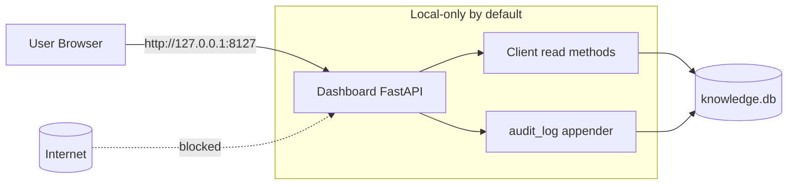
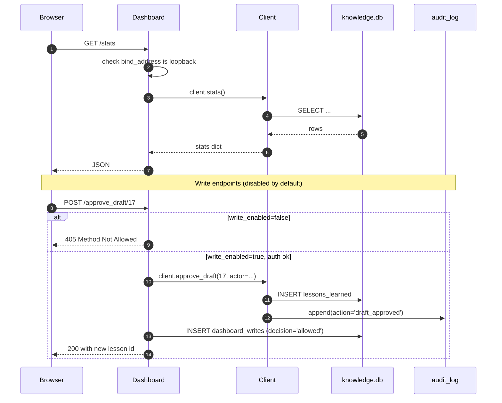

# S9 — Dashboard

> *This specification defines the contract. Implementations must pass the contract tests (named below). Implementations that pass the contract tests are conforming. Implementations that do not are not. There is no "partial conformance." There is no "spirit of the contract." The contract tests are the contract.*

## What this spec replaces

Previously planned: a FastAPI dashboard shipped with the reference implementation. v3 ships only the terminal dashboard equivalent (`runaway stats`). The web dashboard is a spec — adopters who want a browser UI build it against this contract.

The contract's key constraint is `loopback-only by default` (HR-1 in spirit, even if HTTP is involved). A dashboard that listens on `0.0.0.0` is out of contract. A dashboard that requires SSL termination from an external proxy is out of contract. The default install path makes zero network-reachable surface available.

## 1. Integration Contract

### Inputs

| Input | Source | Shape |
|---|---|---|
| `bind_address` | Config | Default `127.0.0.1`. Must be a loopback address by default. |
| `port` | Config | Default `8127`. |
| `auth_mode` | Config | `local-only` (default) / `sso-required` (S1) |
| `read_only` | Config | Default `true`. The dashboard does not write unless explicitly enabled. |

### Outputs

The dashboard exposes a small set of HTTP endpoints. Each is read-only by default.

| Endpoint | Purpose |
|---|---|
| `GET /` | Index page: tier, audit status, top metrics |
| `GET /stats` | JSON dump of `client.stats()` |
| `GET /drafts` | Pending drafts (paginated) |
| `GET /lessons/:id` | Read a lesson |
| `GET /chunks/:id` | Read a chunk |
| `GET /briefs/:slug` | Read a brief |
| `GET /audit` | Audit log entries (paginated, read-only) |
| `GET /maturation/suggestions` | Pending maturation suggestions |
| `GET /specialists` | Specialist list |
| `GET /federation` | Federation source status (if S2 wired) |
| `POST /approve_draft/:id` | (Write — disabled by default) |
| `POST /mature_lesson/:id` | (Write — disabled by default) |

### Invariants

1. **HR-1.** Default `bind_address` is `127.0.0.1`. Binding to a non-loopback requires explicit operator config. The contract test verifies the default.
2. **HR-3.** Write endpoints are off by default. Enabling them requires `dashboard.write_enabled = true` AND `dashboard.auth_mode` is not `local-only` (the operator opts into writes only when authentication is real).
3. **HR-7.** Every write endpoint produces an audit log entry. Read endpoints are not audited individually (telemetry-counted).
4. **HR-10.** A failed read does not return an empty/200 with no data. It returns the appropriate HTTP error code with a structured body.
5. **HR-13.** Dashboard source contains no TODO/FIXME.
6. **HR-14.** Each endpoint has a docstring/OpenAPI definition stating what it does, what it returns, what it refuses, what errors it raises.

### Refusal contract

The dashboard MUST refuse to start if:

- `bind_address` is non-loopback AND `dashboard.auth_mode = 'local-only'` (refuses to expose a writable surface to the network without authentication).
- A write endpoint is enabled but `auth_mode = 'local-only'`.
- The audit chain is broken (does not serve until operator remediates).
- The schema version does not match.

## 2. Schema Additions

The dashboard does not require new tables — it reads the existing schema. It does, however, require a config row to record runtime state:

```sql
CREATE TABLE IF NOT EXISTS dashboard_state (
    id INTEGER PRIMARY KEY CHECK (id = 1),
    last_started_at DATETIME,
    last_stopped_at DATETIME,
    bind_address TEXT,
    port INTEGER,
    auth_mode TEXT,
    write_enabled INTEGER DEFAULT 0
);
INSERT OR IGNORE INTO dashboard_state (id) VALUES (1);

-- Per-request audit table for write endpoints
CREATE TABLE IF NOT EXISTS dashboard_writes (
    id INTEGER PRIMARY KEY AUTOINCREMENT,
    occurred_at DATETIME DEFAULT CURRENT_TIMESTAMP,
    endpoint TEXT NOT NULL,
    request_id TEXT,
    actor_author_id TEXT,
    decision TEXT NOT NULL CHECK (decision IN ('allowed', 'denied')),
    payload_hash TEXT
);
```

## 3. Reference Flow





## 4. Contract Tests

Located under `tests/spec/dashboard/`:

| Test | Asserts |
|---|---|
| `test_dash_default_loopback` | Default config binds to `127.0.0.1` only (HR-1 spirit) |
| `test_dash_non_loopback_requires_auth` | Setting `bind_address = '0.0.0.0'` with `auth_mode='local-only'` refuses to start |
| `test_dash_writes_off_by_default` | `POST /approve_draft/:id` returns 405 with default config |
| `test_dash_writes_audited_when_enabled` | When writes are enabled, each write produces both an `audit_log` row and a `dashboard_writes` row (HR-7) |
| `test_dash_chain_break_blocks_start` | A broken audit chain prevents the dashboard from starting |
| `test_dash_read_errors_structured` | A 404 returns a structured JSON body with code + message (HR-10) |
| `test_dash_schema_mismatch_refused` | Different schema version than the Client's expected refuses to start |
| `test_dash_telemetry_counts_reads` | Read endpoints emit a `metrics.dashboard.read` counter; not audit-logged |
| `test_dash_openapi_documented` | OpenAPI spec is served and contains `description`, `responses`, `400`/`404`/`500` for each endpoint (HR-14) |
| `test_dash_no_todo_markers` | Dashboard source contains no TODO/FIXME/HACK/XXX (HR-13) |

## 5. Anti-Loophole Notes

The adopter's AI MUST NOT:

- **Bind to `0.0.0.0` "for convenience" with no authentication.** The default is loopback; the operator opts in to non-loopback explicitly, and only when authentication is real.
- **Enable write endpoints with `auth_mode='local-only'`.** Local-only means anyone with shell access can hit it; that is not real authentication for writes.
- **Render rendered HTML using untrusted content.** Lessons and chunks contain user content; escape it (XSS, HTML injection).
- **Embed credentials in the URL.** No `?token=...` query params.
- **Add CSRF-exempt write endpoints.** Even for local-only, CSRF protection is on for writes (defense-in-depth).
- **Skip the audit log on a write because it "didn't change anything."** The decision is auditable regardless of effect.
- **Auto-restart on schema mismatch.** Refuse and surface; do not silently apply a migration.
- **Use the dashboard to bypass MCP for AI clients.** The MCP server is the AI surface; the dashboard is the human surface. Cross-wiring is a category error.

## Verification

```bash
pytest tests/spec/dashboard/ -v

# Start the dashboard
runaway dashboard start --bind 127.0.0.1 --port 8127

# Verify
curl -sf http://127.0.0.1:8127/stats | jq .
curl -sf http://127.0.0.1:8127/audit | jq .
curl -sf http://127.0.0.1:8127/openapi.json | jq .info.title

# Try a non-loopback bind without auth — must refuse
runaway dashboard start --bind 0.0.0.0 --port 8127
# expected: exit 2 with "auth_mode=local-only refuses non-loopback binding"

runaway dashboard stop
```
