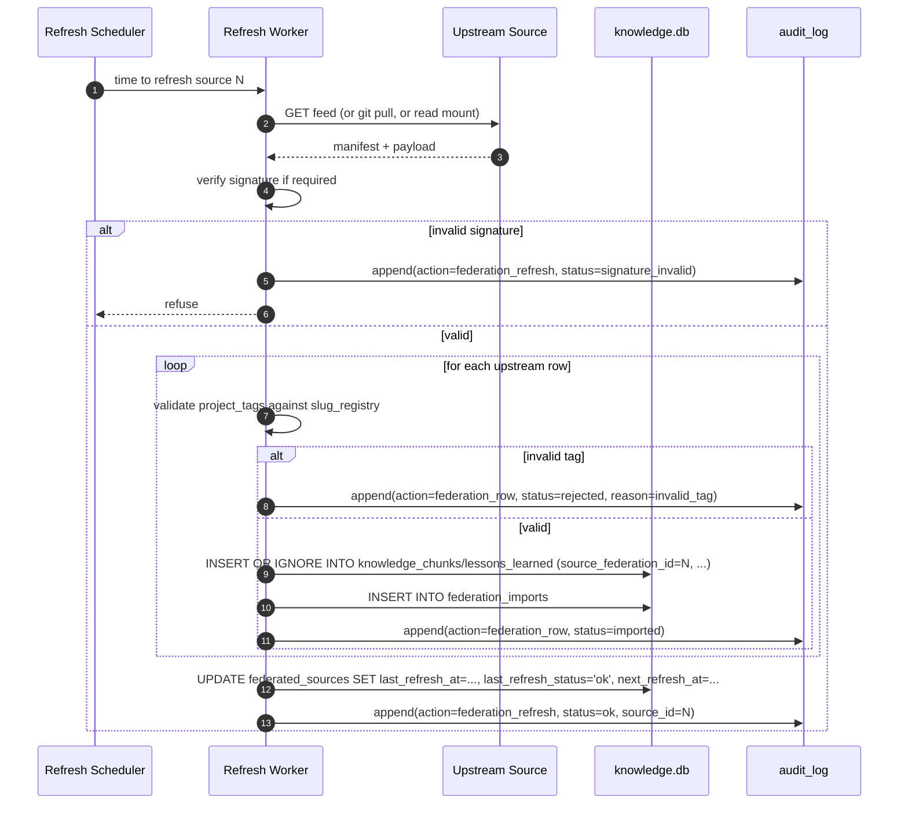

# S2 — Federation

> *This specification defines the contract. Implementations must pass the contract tests (named below). Implementations that pass the contract tests are conforming. Implementations that do not are not. There is no "partial conformance." There is no "spirit of the contract." The contract tests are the contract.*

## What this spec replaces

Previously planned: a built-in federation worker in `src/runaway_context/federation/`. v3 instead ships the contract, the schema, and the trust-model invariants. The adopter's AI builds the worker against the upstream sources their org actually uses (a peer install at another office, a centrally-curated knowledge feed, a vendor's published lesson set, etc.).

Federation is **read-only**: an install pulls from upstream sources; it does not push. There is no "publish" path. There is no bidirectional sync.

## 1. Integration Contract

### Inputs

| Input | Source | Shape |
|---|---|---|
| `source_url` | Config | URL or path to the upstream feed |
| `source_kind` | Config | `git` / `https-json` / `local-mount` |
| `trust_level` | Config | `authoritative` / `advisory` / `untrusted-import` |
| `auth` | Config | Credentials/headers; never embedded in repo |
| `refresh_interval` | Config | Default 1h; min 10m; max 1d |
| `signature_required` | Config | Boolean; required for `authoritative` |

### Outputs

| Output | Shape | Effect |
|---|---|---|
| `imported_chunks` | INSERTs into `knowledge_chunks` with `source_federation_id` set | Available via `search_chunks` |
| `imported_lessons` | INSERTs into `lessons_learned` with `source_federation_id` set | Available via `search_lessons` |
| `federation_audit_entries` | Append to `audit_log` | Auditable record of every refresh |

### Invariants

1. **HR-1.** The refresh worker is allowlisted (`federation.refresh_worker`) and refuses to run without `federation.enabled = true` AND a valid source configuration.
2. **HR-2.** Imported rows MUST carry valid `project_tags`. Untagged rows from the upstream are rejected at the boundary.
3. **HR-3.** Federation imports use `INSERT OR IGNORE` keyed on `(source_federation_id, upstream_id)`. They never overwrite local rows. If a local row exists with the same upstream id, the import is logged as a conflict.
4. **HR-7.** Every refresh is audit-logged. Every imported row is audit-logged individually.
5. **HR-9.** Imported lessons start with `maturity = 'active'` regardless of upstream value (the upstream's curve is not authoritative). Local maturation engine applies.
6. **HR-10.** A failed refresh surfaces to the operator (logs, `runaway federation status`). It never silently retries indefinitely; backoff caps at 1h.

### Refusal contract

The integration MUST refuse to import:

- Rows whose `project_tags` are empty, NULL, or contain unregistered slugs.
- Rows whose visibility level is not in `private/team/org`.
- Rows whose signed manifest does not verify (when `signature_required = true`).
- Rows from an `untrusted-import` source unless the operator has set `--allow-untrusted` for this specific refresh.

## 2. Schema Additions

```sql
CREATE TABLE IF NOT EXISTS federated_sources (
    id INTEGER PRIMARY KEY AUTOINCREMENT,
    name TEXT NOT NULL UNIQUE,
    source_url TEXT NOT NULL,
    source_kind TEXT NOT NULL CHECK (source_kind IN ('git', 'https-json', 'local-mount')),
    trust_level TEXT NOT NULL CHECK (trust_level IN ('authoritative', 'advisory', 'untrusted-import')),
    signature_pubkey TEXT,
    refresh_interval_seconds INTEGER NOT NULL DEFAULT 3600,
    last_refresh_at DATETIME,
    last_refresh_status TEXT,
    next_refresh_at DATETIME,
    enabled INTEGER DEFAULT 1
);

CREATE TABLE IF NOT EXISTS federation_imports (
    id INTEGER PRIMARY KEY AUTOINCREMENT,
    source_id INTEGER NOT NULL REFERENCES federated_sources(id) ON DELETE CASCADE,
    upstream_id TEXT NOT NULL,
    target_table TEXT NOT NULL CHECK (target_table IN ('knowledge_chunks', 'lessons_learned')),
    target_record_id INTEGER,
    upstream_payload_hash TEXT NOT NULL,
    imported_at DATETIME DEFAULT CURRENT_TIMESTAMP,
    conflict INTEGER DEFAULT 0,
    conflict_reason TEXT,
    UNIQUE(source_id, upstream_id, target_table)
);

ALTER TABLE knowledge_chunks ADD COLUMN source_federation_id INTEGER REFERENCES federated_sources(id);
ALTER TABLE lessons_learned  ADD COLUMN source_federation_id INTEGER REFERENCES federated_sources(id);
```

`source_federation_id` is NULL for locally-authored rows. When set, retrieval can display "imported from `<source_name>`" in the brief.

## 3. Reference Flow



## 4. Contract Tests

Located under `tests/spec/federation/`:

| Test | Asserts |
|---|---|
| `test_fed_disabled_no_network` | With `federation.enabled = false`, the refresh worker module's network calls are never executed (HR-1) |
| `test_fed_invalid_tag_rejected` | An upstream row with an unregistered slug is rejected and audited (HR-2) |
| `test_fed_no_overwrite_local` | When a local row exists with the same upstream id, the federation row is logged as a conflict; local row is unchanged (HR-3) |
| `test_fed_signature_required_blocks_unsigned` | With `signature_required=true`, an unsigned manifest produces no inserts |
| `test_fed_authoritative_signed_imports` | A correctly-signed authoritative source imports rows and tags them with `source_federation_id` |
| `test_fed_untrusted_requires_allow_flag` | An `untrusted-import` source refuses without `--allow-untrusted` |
| `test_fed_audit_every_row` | After a refresh of N rows, the audit log has ≥N + 1 new rows (one per import + one refresh-level row) |
| `test_fed_maturity_reset_on_import` | An upstream lesson with `maturity='internalized'` lands locally with `maturity='active'` (HR-9) |
| `test_fed_failure_backoff` | A series of consecutive failures backs off but never blocks indefinitely (HR-10) |
| `test_fed_docstrings_complete` | Every public method of the worker has `Returns:`, `Raises:`, `Refuses:` |

## 5. Anti-Loophole Notes

The adopter's AI MUST NOT:

- **Add a "push" path.** Federation is read-only. A push path turns the install into a hub, which is out of scope and changes the trust model. If you want bidirectional sync, use the T3 git-based JSON export/import (HR-3/HR-4 compatible).
- **Skip the audit log per row.** A per-refresh summary is not sufficient — HR-7 requires per-row auditability for traceability.
- **Treat upstream maturity as authoritative.** An upstream's `internalized` lesson does not internalize locally; local engine runs on local signals.
- **Use the IdP's auth tokens (S1) for federation auth.** They are separate credentials with separate rotation cycles. Mixing them is a privilege escalation footgun.
- **Auto-merge conflicts.** When a local row exists with the same upstream id, the federation import logs the conflict; the operator resolves manually. Auto-merge violates HR-3 (writes are recoverable but conflicts are not "no-op").
- **Implement bidirectional reconciliation.** That is a different problem with different invariants — out of scope.
- **Embed credentials in `federated_sources.source_url`.** Credentials live in keyring / env / OS secret store; the URL is plain.

## Verification

```bash
pytest tests/spec/federation/ -v
pytest -m contract -v          # confirm HR-* still pass
runaway federation status      # human-readable source status
runaway audit verify           # chain must remain intact
```
