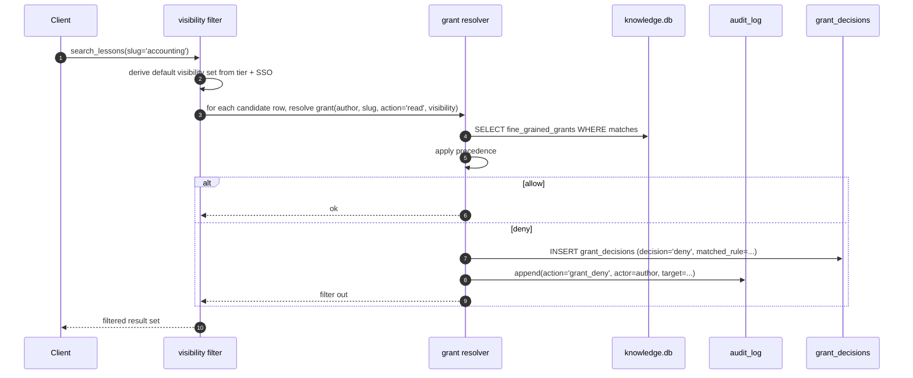

# S5 — Fine-Grained Grants

> *This specification defines the contract. Implementations must pass the contract tests (named below). Implementations that pass the contract tests are conforming. Implementations that do not are not. There is no "partial conformance." There is no "spirit of the contract." The contract tests are the contract.*

## What this spec replaces

Previously planned: a built-in role/permission engine for T5. v3 ships the schema for fine-grained grants and the precedence rules; the adopter's AI wires the binding to their existing identity / RBAC system (typically via S1 — SSO Integration).

Fine-grained grants layer **over** visibility ACLs (which live in `knowledge_chunks.visibility` and `lessons_learned.visibility`). Visibility is the coarse filter; grants are the fine adjustments — e.g., "user X can read project Y even though it's `private`," or "group Z cannot mature lessons in project W even though they can read them."

## 1. Integration Contract

### Inputs

| Input | Source | Shape |
|---|---|---|
| `author_id` | S1 SSO binding | The opaque 12-char identifier |
| `groups` | S1 SSO binding | The user's current groups |
| `slug` | Operation | The project slug the operation targets |
| `action` | Operation | One of: `read`, `write`, `approve`, `mature`, `delete`, `admin` |
| `record_visibility` | The target row | `private` / `team` / `org` |

### Outputs

| Output | Shape |
|---|---|
| `decision` | `allow` / `deny` |
| `reason` | Free-text rationale (for audit) |

### Invariants

1. **HR-2.** Grants are tagged by slug. A grant without a slug is invalid.
2. **HR-7.** Every grant decision that denies a request is audit-logged. Allow decisions are not audit-logged individually (would be too noisy); they are counted in telemetry.
3. **HR-9.** A grant that allows `mature` does not bypass the human-approval requirement — it grants the *authority* to approve, not the *automatic* application.
4. **HR-10.** Grant resolution failure (e.g., DB unreachable) surfaces as `GrantResolutionFailed`, not a silent allow or silent deny.
5. **HR-14.** The grant resolution function has `Returns: allow|deny`, `Raises: GrantResolutionFailed`, `Refuses: silent fallback`.

### Precedence rules

When multiple grants apply to the same `(author_id, slug, action)`, precedence is:

```
1. explicit author_id deny     (highest)
2. explicit author_id allow
3. explicit group deny
4. explicit group allow
5. visibility-derived default  (private = only author; team = any member; org = any in install)
6. install default deny        (lowest)
```

The first matching rule wins. **Deny is sticky** — once any rule at the same level denies, all-allows at lower levels do not override.

## 2. Schema Additions

```sql
CREATE TABLE IF NOT EXISTS fine_grained_grants (
    id INTEGER PRIMARY KEY AUTOINCREMENT,
    subject_type TEXT NOT NULL CHECK (subject_type IN ('author', 'group')),
    subject_id TEXT NOT NULL,             -- author_id OR group identifier
    slug TEXT NOT NULL REFERENCES slug_registry(slug),
    action TEXT NOT NULL
        CHECK (action IN ('read', 'write', 'approve', 'mature', 'delete', 'admin')),
    decision TEXT NOT NULL CHECK (decision IN ('allow', 'deny')),
    reason TEXT,
    created_at DATETIME DEFAULT CURRENT_TIMESTAMP,
    created_by TEXT,
    expires_at DATETIME,
    UNIQUE(subject_type, subject_id, slug, action)
);
CREATE INDEX IF NOT EXISTS idx_grants_subject ON fine_grained_grants(subject_type, subject_id);
CREATE INDEX IF NOT EXISTS idx_grants_slug    ON fine_grained_grants(slug);
CREATE INDEX IF NOT EXISTS idx_grants_expires ON fine_grained_grants(expires_at);

CREATE TABLE IF NOT EXISTS grant_decisions (
    id INTEGER PRIMARY KEY AUTOINCREMENT,
    author_id TEXT NOT NULL,
    slug TEXT NOT NULL,
    action TEXT NOT NULL,
    decision TEXT NOT NULL,
    matched_grant_id INTEGER REFERENCES fine_grained_grants(id),
    matched_rule TEXT NOT NULL,
    decided_at DATETIME DEFAULT CURRENT_TIMESTAMP
);
CREATE INDEX IF NOT EXISTS idx_dec_author_time ON grant_decisions(author_id, decided_at DESC);
```

`grant_decisions` is the deny-log (per HR-7, denies are audited). For volume reasons it lives in its own table rather than `audit_log`; an `audit_log` row links by id when a deny is the cause of a refused operation.

## 3. Reference Flow



## 4. Contract Tests

Located under `tests/spec/fine_grained_grants/`:

| Test | Asserts |
|---|---|
| `test_fgg_default_install_deny` | Without any explicit grants, an unfamiliar author resolving against a `private` row gets deny |
| `test_fgg_author_overrides_group` | An author-level deny defeats a group-level allow (precedence rules) |
| `test_fgg_deny_sticky` | If any rule at the highest applicable level denies, lower-level allows do not override |
| `test_fgg_expired_ignored` | A grant past `expires_at` is treated as if it does not exist |
| `test_fgg_decisions_logged` | Every deny produces a `grant_decisions` row AND an `audit_log` entry |
| `test_fgg_allow_decisions_not_audited` | Allow decisions do not produce `audit_log` rows (volume control); they are telemetry-counted |
| `test_fgg_mature_grant_no_auto_apply` | A `mature` grant does not bypass HR-9 — it grants authority, not automatic application |
| `test_fgg_unknown_slug_refused` | A grant referencing a non-registered slug is refused at INSERT |
| `test_fgg_resolution_failure_raises` | DB unavailable during grant resolution raises `GrantResolutionFailed` (HR-10) |
| `test_fgg_docstrings_complete` | Public methods have `Returns:`, `Raises:`, `Refuses:` |

## 5. Anti-Loophole Notes

The adopter's AI MUST NOT:

- **Treat absent grant data as allow.** Default is install-default-deny. If the install's policy is "open by default," that is set via the `install default` rule, not inferred from missing data.
- **Auto-grant on tier promotion.** Promoting to T4/T5 does not silently grant admin to anyone. Grants are explicit.
- **Use group identifiers as `author_id`.** They are namespaced separately (`subject_type='group'`). Mixing them up creates audit holes.
- **Skip the audit log on deny.** Every deny is auditable. Suppressing denies hides abuse patterns.
- **Cache grant decisions for more than the configured TTL.** Stale decisions = stale authorization. Default TTL is 60 seconds.
- **Implement "shadow allow"** (allow but flag for review). Either allow or deny. Flag-for-review is an HR-10 silent-failure pattern.
- **Add an admin path that bypasses grant resolution.** The Client's admin paths still resolve grants; they just typically match an `admin` rule.

## Verification

```bash
pytest tests/spec/fine_grained_grants/ -v
pytest -m contract -v          # HR-* still pass

# Inspect grant decisions
runaway grants list                  # current grants
runaway grants decisions --recent    # recent denies
runaway audit verify                 # chain still intact
```
