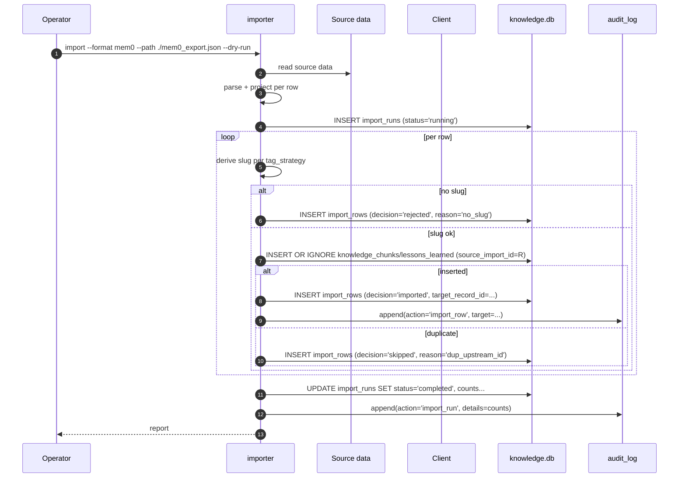

# S8 — Importers

> *This specification defines the contract. Implementations must pass the contract tests (named below). Implementations that pass the contract tests are conforming. Implementations that do not are not. There is no "partial conformance." There is no "spirit of the contract." The contract tests are the contract.*

## What this spec replaces

Previously planned: built-in importers for Mem0, OpenMemory, generic RAG snapshots, raw markdown. v3 ships the contract for *any* importer; the adopter's AI builds the specific source-format → RunawayContext mapping.

Importing is a one-way operation. v3 RunawayContext does not export back to Mem0 / OpenMemory. The import is the *intake* step in the AI-native OSS model: existing knowledge in another tool comes in, is tagged, is normalized into the schema, and becomes part of the same contract-enforced surface as locally-authored knowledge.

## 1. Integration Contract

### Inputs

| Input | Source | Shape |
|---|---|---|
| `source_format` | Operator | `mem0` / `openmemory` / `generic-rag-json` / `markdown-dir` |
| `source_path` | Operator | Path to the source data |
| `tag_strategy` | Operator | `from-file-path` / `from-metadata` / `explicit-default` |
| `default_slug` | Operator | Used when `tag_strategy = explicit-default` |
| `kind_default` | Operator | `chunk` or `lesson` — default destination table for ambiguous rows |
| `dry_run` | Operator | Default true |

### Outputs

| Output | Effect |
|---|---|
| `knowledge_chunks` and/or `lessons_learned` rows | Imported content lives in the standard tables |
| `import_runs` row | Records the run, source, counts, conflicts |
| Audit log entries | One per imported row + one summary row |

### Invariants

1. **HR-2.** Every imported row must be tagged. If the importer cannot derive a slug, the row is rejected with a clear "no slug — provide `--default-slug` or fix metadata" error.
2. **HR-3.** Imports never overwrite local rows. They use `INSERT OR IGNORE` keyed on `(source_format, source_id)` where `source_id` is whatever the upstream tool calls the row.
3. **HR-7.** Every imported row produces an audit entry. The summary row at end-of-run includes total imported, total skipped, total rejected.
4. **HR-9.** Imported lessons start at `maturity='active'`. The upstream's notion of "maturity" or "importance" or "frequency" is captured in metadata but does not bypass the local maturation engine.
5. **HR-10.** A failed import does not leave a partial state. The importer uses transactions: either all valid rows from a batch land or none do.

### Refusal contract

The importer MUST refuse to proceed if:

- `source_format` is not in the recognized set.
- `source_path` is unreadable or empty.
- The configured `tag_strategy` cannot derive a slug AND `--default-slug` is unset.
- The audit chain is broken at startup.

## 2. Schema Additions

```sql
CREATE TABLE IF NOT EXISTS import_runs (
    id INTEGER PRIMARY KEY AUTOINCREMENT,
    source_format TEXT NOT NULL,
    source_path TEXT NOT NULL,
    started_at DATETIME DEFAULT CURRENT_TIMESTAMP,
    completed_at DATETIME,
    status TEXT DEFAULT 'running'
        CHECK (status IN ('running', 'completed', 'failed', 'cancelled')),
    rows_total INTEGER DEFAULT 0,
    rows_imported INTEGER DEFAULT 0,
    rows_skipped INTEGER DEFAULT 0,
    rows_rejected INTEGER DEFAULT 0,
    error_message TEXT,
    operator TEXT
);

CREATE TABLE IF NOT EXISTS import_rows (
    id INTEGER PRIMARY KEY AUTOINCREMENT,
    import_run_id INTEGER NOT NULL REFERENCES import_runs(id) ON DELETE CASCADE,
    source_id TEXT NOT NULL,
    target_table TEXT CHECK (target_table IN ('knowledge_chunks', 'lessons_learned')),
    target_record_id INTEGER,
    decision TEXT NOT NULL CHECK (decision IN ('imported', 'skipped', 'rejected')),
    rejection_reason TEXT,
    upstream_payload_hash TEXT NOT NULL,
    UNIQUE(import_run_id, source_id)
);

ALTER TABLE knowledge_chunks ADD COLUMN source_import_id INTEGER REFERENCES import_runs(id);
ALTER TABLE lessons_learned  ADD COLUMN source_import_id INTEGER REFERENCES import_runs(id);
```

`source_import_id` lets retrieval show "imported from Mem0 on 2026-05-13" on a chunk. It is NULL for locally-authored content.

## 3. Reference Flow



## 4. Contract Tests

Located under `tests/spec/importers/`:

| Test | Asserts |
|---|---|
| `test_imp_dry_run_default` | Without explicit `--apply` or equivalent, no INSERTs occur in `knowledge_chunks` / `lessons_learned` |
| `test_imp_missing_slug_rejected` | Rows without derivable slug AND no `--default-slug` are rejected (HR-2) |
| `test_imp_default_slug_applied` | With `--default-slug`, rows that can't derive a slug get the default; the audit notes "default_slug_applied" |
| `test_imp_no_overwrite_local` | A row with the same `source_id` as a previous import is skipped, never overwritten (HR-3) |
| `test_imp_transactional_failure` | If the importer fails mid-batch, the transaction rolls back; no partial state |
| `test_imp_audit_per_row` | Each imported row produces an `audit_log` entry; the summary row at end includes total counts (HR-7) |
| `test_imp_imported_lesson_maturity_active` | An imported lesson lands at `maturity='active'` regardless of upstream value (HR-9) |
| `test_imp_source_import_id_set` | Imported rows have `source_import_id` set; query path can find them |
| `test_imp_unknown_format_refused` | `--format mystery` is refused with a clear error |
| `test_imp_chain_break_blocks` | A broken audit chain blocks the importer from starting |
| `test_imp_docstrings_complete` | Importer public surface has `Returns:`, `Raises:`, `Refuses:` |

## 5. Anti-Loophole Notes

The adopter's AI MUST NOT:

- **Auto-tag with the source's own labels** without operator review. Source labels may not map to canonical slugs. Always derive via the configured `tag_strategy`.
- **Set a global "default visibility" of `team` or `org` on import.** Imported content should default to `private`; the operator promotes if appropriate.
- **Overwrite local content** even when the upstream "looks newer." HR-3 says writes are recoverable; an import that overwrites is not recoverable in spirit.
- **Auto-merge duplicates** across source formats. If the same content exists from Mem0 and from OpenMemory, the operator decides which to keep.
- **Skip per-row audit "for performance."** The summary row alone is not sufficient (HR-7).
- **Add a `--force` flag that bypasses the slug requirement.** The proper escape is `--default-slug <slug>` with the slug explicitly set.
- **Read the source file with elevated privileges** (sudo, setuid, etc.). The importer runs as the operator's normal user.

## Verification

```bash
pytest tests/spec/importers/ -v

# Smoke
runaway import --format markdown-dir --path ./old-notes --default-slug general --dry-run
runaway import --format markdown-dir --path ./old-notes --default-slug general --apply
runaway import-runs list
runaway audit list --action import_run
```
