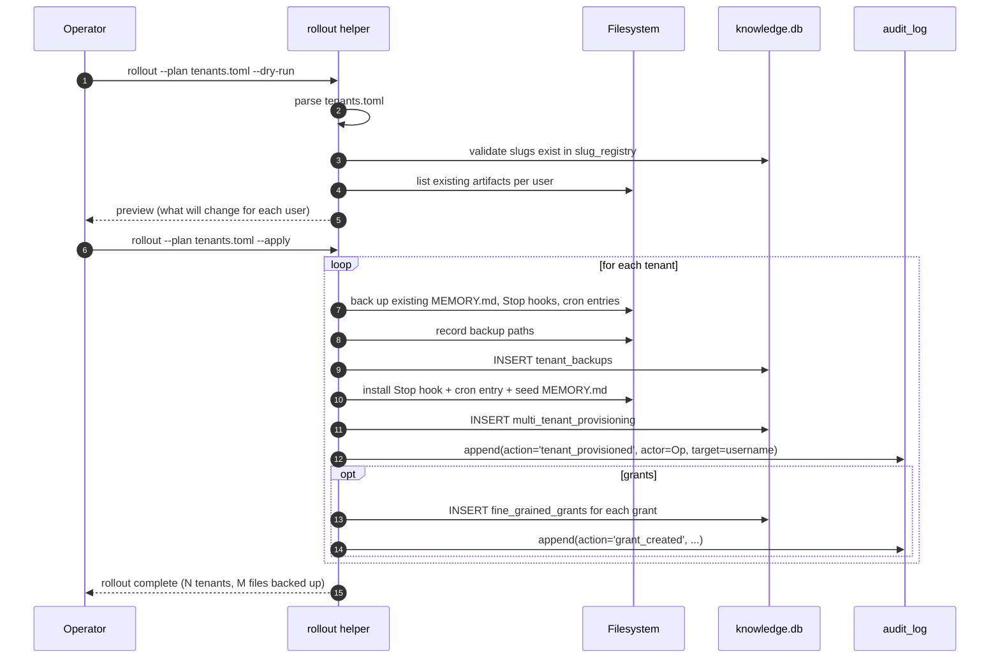

# S7 — Multi-Tenant Rollout

> *This specification defines the contract. Implementations must pass the contract tests (named below). Implementations that pass the contract tests are conforming. Implementations that do not are not. There is no "partial conformance." There is no "spirit of the contract." The contract tests are the contract.*

## What this spec replaces

Previously planned: a built-in `setup_user_protections.sh` extended for multi-tenant rollout. v3 ships the contract for the rollout helper; the adopter's AI builds the actual provisioning script against their OS, identity provider, file-system permissions model, and shared-host conventions.

This spec sits at the intersection of T3 / T4. The rollout helper provisions multiple users on a shared host (or coordinates provisioning across a fleet) so that every user's install is the same canonical surface — same slug registry, same MCP wiring, same drift detector, same audit log convention.

## 1. Integration Contract

### Inputs

| Input | Source | Shape |
|---|---|---|
| `tenant_list` | Operator | List of `(username, mode, role, grants)` tuples |
| `mode` | Per-tenant | `personal` / `shared-read` / `shared-write` |
| `role` | Per-tenant | `user` / `runaway_admin` |
| `grants` | Per-tenant | Initial fine-grained grants (see S5) |
| `backup_strategy` | Config | What to back up before any modification |

### Outputs

| Output | Effect |
|---|---|
| Per-user Stop hooks, MEMORY.md, drift watcher cron entries | Each user has the v3 surface |
| Audit log entries for every tenant created / modified | Auditable rollout |
| `multi_tenant_provisioning` table populated | Records which user is at which state |

### Invariants

1. **HR-2.** Tenant slug bindings are tagged. A tenant provisioned for slug `accounting` is recorded against that slug.
2. **HR-4.** The rollout helper is non-destructive. If a user already has Stop hooks, MEMORY.md, or drift entries, the helper backs them up before modification (`.pre-rollout-<timestamp>.bak`).
3. **HR-6.** The provisioning record stores the user's local username (operational), the opaque `author_id` (derived), and the SSO subject (when applicable). It does not promote the local username into `author_display`.
4. **HR-7.** Every provisioning step is audit-logged. The audit log entry includes the username being modified and the action taken.
5. **HR-13.** The rollout scripts contain no TODO/FIXME.
6. **HR-15.** The rollout is idempotent. Running it twice produces no additional changes.

### Refusal contract

The rollout helper MUST refuse to proceed if:

- The tenant list is malformed.
- A tenant's mode is unrecognized.
- The shared-host filesystem permissions cannot guarantee per-user isolation in `personal` mode.
- The audit log chain is broken at startup.
- The dry-run produced any rollback path (the helper requires `--apply` to actually modify; default is dry-run).

## 2. Schema Additions

```sql
CREATE TABLE IF NOT EXISTS multi_tenant_provisioning (
    id INTEGER PRIMARY KEY AUTOINCREMENT,
    tenant_username TEXT NOT NULL,
    tenant_author_id TEXT,
    mode TEXT NOT NULL CHECK (mode IN ('personal', 'shared-read', 'shared-write')),
    role TEXT NOT NULL CHECK (role IN ('user', 'runaway_admin')),
    provisioned_at DATETIME DEFAULT CURRENT_TIMESTAMP,
    provisioned_by TEXT,
    last_audit_at DATETIME,
    status TEXT DEFAULT 'active' CHECK (status IN ('active', 'suspended', 'retired')),
    notes TEXT,
    UNIQUE(tenant_username)
);

CREATE TABLE IF NOT EXISTS tenant_backups (
    id INTEGER PRIMARY KEY AUTOINCREMENT,
    tenant_id INTEGER NOT NULL REFERENCES multi_tenant_provisioning(id) ON DELETE CASCADE,
    file_path TEXT NOT NULL,
    backup_path TEXT NOT NULL,
    backed_up_at DATETIME DEFAULT CURRENT_TIMESTAMP,
    backed_up_by TEXT
);
```

`tenant_backups` records every file that was moved aside before the rollout modified it. Together with the audit log, it provides a complete trail of "what did this rollout actually do to each user."

## 3. Reference Flow



## 4. Contract Tests

Located under `tests/spec/multi_tenant_rollout/`:

| Test | Asserts |
|---|---|
| `test_rollout_dry_run_default` | Without `--apply`, no filesystem changes are made |
| `test_rollout_backs_up_before_modifying` | Existing user files are moved to backup paths before modification (HR-4) |
| `test_rollout_idempotent` | Running the rollout twice produces no additional changes (HR-15) |
| `test_rollout_invalid_mode_refused` | A tenant with `mode='cluster-admin'` is refused at parse time |
| `test_rollout_unknown_slug_refused` | A grant referencing an unregistered slug is refused (HR-2) |
| `test_rollout_audits_every_tenant` | Each tenant produces an `audit_log` entry (HR-7) |
| `test_rollout_per_user_isolation` | In `personal` mode, each user's files have permissions that prevent other users reading them |
| `test_rollout_admin_role_audited` | A tenant provisioned with `role='runaway_admin'` produces an additional audit entry |
| `test_rollout_chain_break_blocks` | A broken audit chain prevents the rollout from starting |
| `test_rollout_docstrings_complete` | The helper's public surface has `Returns:`, `Raises:`, `Refuses:` |

## 5. Anti-Loophole Notes

The adopter's AI MUST NOT:

- **Skip backup of "obviously trivial" existing files.** Every file the rollout touches must be backed up first (HR-4). The trivial-looking file was someone's important config.
- **Provision a tenant with no audit entry "to reduce noise."** Every provisioning is auditable.
- **Use the rollout to *also* migrate the user's data.** Rollout provisions; migration is `runaway migrate`. They are separate concerns with separate audit trails.
- **Auto-elevate a user to `runaway_admin`** based on OS group membership. The role is set by the operator at rollout, explicitly, with an audit entry.
- **Apply grants before the user is provisioned.** Grants require an `author_id`, which requires provisioning to complete first.
- **Run with `--apply` without a successful `--dry-run`.** The helper must support dry-run; the operator must use it. Calling `--apply` directly is the sloppy path; the contract requires both.
- **Continue past per-tenant errors silently.** On per-tenant failure, the rollout records the failure in audit and either rolls back that tenant or surfaces and halts (configurable via `--on-error abort|continue`).

## Verification

```bash
pytest tests/spec/multi_tenant_rollout/ -v

# Dry-run preview
runaway rollout --plan ./tenants.toml --dry-run

# Apply (after reviewing preview)
runaway rollout --plan ./tenants.toml --apply

# Verify
runaway tenants list                       # provisioned tenants
runaway audit list --action tenant_provisioned   # audit trail
ls -la /home/<user>/.claude/                # backed-up files present
```
