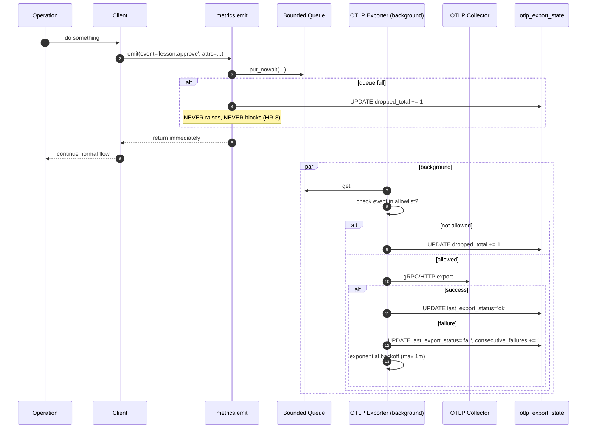

# S3 — OTLP Export

> *This specification defines the contract. Implementations must pass the contract tests (named below). Implementations that pass the contract tests are conforming. Implementations that do not are not. There is no "partial conformance." There is no "spirit of the contract." The contract tests are the contract.*

## What this spec replaces

Previously planned: an OpenTelemetry exporter shipped in the default install. v3 instead ships the contract for an opt-in exporter that conforms to the never-blocks invariant (HR-8) and the network-egress-allowlist invariant (HR-1).

OTLP export is a **T5** feature. Adopters who want to ship RunawayContext metrics into their organization's observability stack build this against their actual collector (Honeycomb, Grafana Tempo, Jaeger, Datadog, internal Prometheus, etc.).

## 1. Integration Contract

### Inputs

| Input | Source | Shape |
|---|---|---|
| `endpoint` | Config | OTLP gRPC or HTTP endpoint URL |
| `auth_headers` | Config (from secret store) | Headers to attach to each request |
| `event_allowlist` | Config | The list of event names this exporter is permitted to emit |
| `service_name` | Config | OTLP resource attribute (e.g., `runaway-context-<install_id>`) |
| `protocol` | Config | `grpc` or `http/protobuf` |

### Outputs

| Output | Effect |
|---|---|
| OTLP traces/metrics to the configured collector | External observability has visibility into install operations |
| `metrics.db` retains a local copy of every emission | Local-first; loss of collector does not lose data |

### Invariants

1. **HR-1.** The exporter module (`metrics.otlp_exporter`) is allowlisted. It refuses to start without `metrics.otlp.enabled = true` AND a non-empty `endpoint`.
2. **HR-8.** A failed export does not block, delay, or fail any real operation. Backoff queue is bounded; on saturation, oldest events are dropped and a local counter `otlp.dropped` is incremented (not exported).
3. **HR-10.** Failures surface to the operator via `runaway stats --otlp-status` and via local logs. They do not surface to the caller of the operation that emitted the metric.
4. **HR-13.** The exporter code carries no TODO/FIXME/HACK/XXX markers.
5. **Allowlist-only events.** Only events in `event_allowlist` are exported. Events outside the list are dropped silently (and counted) — the local DB still records them.

### Refusal contract

The exporter MUST refuse:

- To start if `endpoint` is unset or unreadable.
- To export events not in the allowlist.
- To attach any payload field tagged `pii=true` in the local schema (defense-in-depth against HR-6 violations).
- To export when the install is at a tier below T5 unless explicitly overridden in config.

## 2. Schema Additions

```sql
CREATE TABLE IF NOT EXISTS otlp_event_allowlist (
    event_name TEXT PRIMARY KEY,
    enabled INTEGER DEFAULT 1,
    description TEXT,
    added_at DATETIME DEFAULT CURRENT_TIMESTAMP,
    added_by TEXT
);

CREATE TABLE IF NOT EXISTS otlp_export_state (
    id INTEGER PRIMARY KEY CHECK (id = 1),
    last_export_at DATETIME,
    last_export_status TEXT,
    queue_depth INTEGER DEFAULT 0,
    dropped_total INTEGER DEFAULT 0,
    consecutive_failures INTEGER DEFAULT 0
);
INSERT OR IGNORE INTO otlp_export_state (id) VALUES (1);

-- Tag for events that must never be exported (defense-in-depth for HR-6)
ALTER TABLE metrics_events ADD COLUMN pii_tag INTEGER DEFAULT 0;
```

The `otlp_event_allowlist` table is the source of truth for which events the exporter is permitted to send. Default install has it empty — meaning even with the exporter enabled, zero events leave the host until the operator explicitly allowlists.

## 3. Reference Flow



## 4. Contract Tests

Located under `tests/spec/otlp_export/`:

| Test | Asserts |
|---|---|
| `test_otlp_default_disabled_no_network` | With `metrics.otlp.enabled = false`, the exporter is never instantiated and no network module is imported (HR-1) |
| `test_otlp_emit_never_blocks` | Calling `emit()` 10,000 times with collector unreachable completes in <100ms (HR-8) |
| `test_otlp_emit_never_raises` | `emit()` with collector unreachable / malformed / etc. never raises into the caller (HR-8) |
| `test_otlp_allowlist_enforced` | An event not in `otlp_event_allowlist` is never sent over the wire, even when exporter is running |
| `test_otlp_pii_tag_blocks_export` | An event with `pii_tag = 1` is dropped at the exporter; counter increments |
| `test_otlp_backoff_bounded` | Consecutive failures back off exponentially but cap at 60 seconds |
| `test_otlp_local_db_still_records` | Even when export fails, the local `metrics.db` row is written; no data loss |
| `test_otlp_queue_saturation_drops_oldest` | When queue is full, oldest entries drop; counter increments; emit() still returns immediately |
| `test_otlp_status_surfaces_to_stats` | `runaway stats --otlp-status` reports last status, queue depth, dropped total |
| `test_otlp_docstrings_complete` | Every public method has `Returns:`, `Raises:`, `Refuses:` |

## 5. Anti-Loophole Notes

The adopter's AI MUST NOT:

- **Make emit() block waiting for queue space.** This violates HR-8. Use `put_nowait` and drop+count on saturation.
- **Add a "synchronous emit" mode.** No such mode exists. Telemetry is always fire-and-forget.
- **Wrap emit() in a synchronous wait for ACK.** Again, HR-8 violation.
- **Bypass the allowlist.** Adding "just one more" event for a debugging purpose violates the contract. Add it to the allowlist explicitly.
- **Export PII-tagged events.** The schema's `pii_tag` is defense-in-depth; the exporter is the gate. Bypassing is HR-6 violation.
- **Use a non-OTLP protocol.** This spec is OTLP. If you want to export to a non-OTLP system, build a different spec.
- **Auto-enable on tier promotion to T5.** The operator opts in explicitly. T5 unlocks the capability; it does not flip the switch.
- **Forget to surface failures.** The local stats and logs must reflect export status. HR-10 means a sustained export failure is visible.

## Verification

```bash
pytest tests/spec/otlp_export/ -v

# Smoke test against a local collector (e.g., otel-cli or jaeger-all-in-one)
runaway config set metrics.otlp.enabled true
runaway config set metrics.otlp.endpoint "http://127.0.0.1:4318"
runaway stats --otlp-status
# expected: enabled, queue depth, last status

# Run a typical workload
runaway brief regen-all
sleep 2
runaway stats --otlp-status
# expected: events exported (or queued)
```
