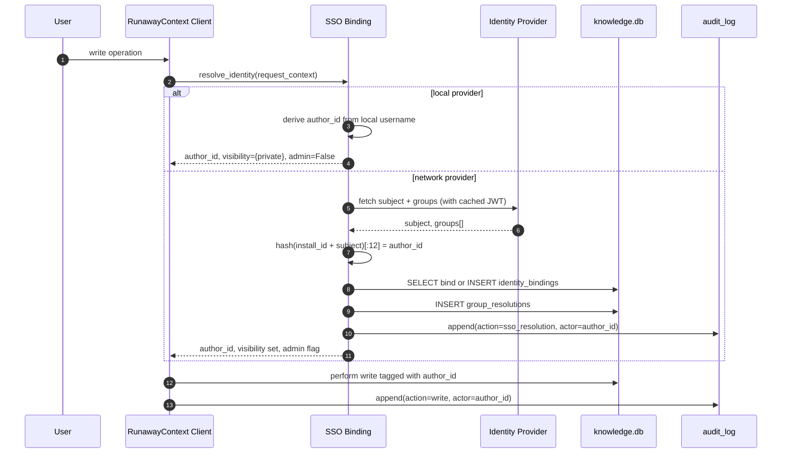

# S1 — SSO Integration

> *This specification defines the contract. Implementations must pass the contract tests (named below). Implementations that pass the contract tests are conforming. Implementations that do not are not. There is no "partial conformance." There is no "spirit of the contract." The contract tests are the contract.*

## What this spec replaces

Previously planned: a built-in SSO implementation in `src/runaway_context/`. v3 instead ships the contract and lets the adopter's AI build the binding against the local identity provider (Okta, Azure AD, Auth0, Keycloak, an internal IdP, etc.).

## 1. Integration Contract

### Inputs

The integration consumes:

| Input | Source | Shape |
|---|---|---|
| `subject` | Identity provider | An opaque string uniquely identifying a user within the IdP (e.g., Azure `oid`, Okta `sub`, Auth0 `user_id`) |
| `groups` | Identity provider | An array of group identifiers the user belongs to at request time (groups, roles, scopes — the IdP's flavor) |
| `display_hint` | Identity provider | Optional human-readable name. The integration MUST NOT pass this to `authors.display_name` unless the user explicitly opted in via `set_visibility` or `accept_display_name` (HR-6) |
| `request_timestamp` | RunawayContext Client | UTC datetime of the request |
| `install_id` | RunawayContext config | The opaque per-install identifier used to derive `author_id` |

### Outputs

The integration produces:

| Output | Shape | Used by |
|---|---|---|
| `author_id` | `sha256(install_id + idp_subject)[:12]` | All write paths on the Client |
| `effective_visibility_set` | `{'private', 'team'}` or `{'private', 'team', 'org'}` based on group resolution | `Client.search_*` filters |
| `is_admin` | `bool` | Admin-only paths (`hard-delete`, `slug merge`, `tier promote`) |
| `group_membership` | `list[str]` | Fine-grained grants (S5) when enabled |

### Invariants

The integration MUST hold these invariants at all times:

1. **HR-1.** No network call to the IdP unless `sso.enabled = true` AND `sso.provider != 'local'` in the install config. The default (local) provider derives `author_id` from the local username with no network call.
2. **HR-6.** The `author_id` is opaque. It MUST NOT contain `@`, `.`, or any email-shaped value. The schema CHECK constraints are the secondary guard; the integration is the primary.
3. **HR-7.** Every group resolution result is recorded in the audit log if it changes the effective visibility set. The audit row is appended atomically with the request.
4. **HR-10.** A failed group resolution MUST surface to the caller as a `SSOGroupResolutionFailed` exception. It MUST NOT silently fall back to "everyone is admin" or "everyone is private."
5. **HR-14.** Every public method of the SSO binding has a docstring with `Returns:`, `Raises:`, `Refuses:` sections.

### Refusal contract

The integration MUST refuse to start if:

- `sso.enabled = true` but `sso.provider` is unset.
- `sso.provider` is set but the required credentials (client id, secret, JWKS URL, etc.) are unset or unreadable.
- The IdP's groups response shape does not match the configured projection.
- A user's `subject` collides with an already-bound `author_id` for a different `subject` (collision = potential takeover).

## 2. Schema Additions

The adopter's AI applies the following DDL (additive only — HR-4):

```sql
CREATE TABLE IF NOT EXISTS identity_bindings (
    author_id TEXT PRIMARY KEY,
    provider TEXT NOT NULL,
    subject TEXT NOT NULL,
    display_hint TEXT,
    is_admin INTEGER DEFAULT 0,
    bound_at DATETIME DEFAULT CURRENT_TIMESTAMP,
    last_seen DATETIME,
    UNIQUE(provider, subject),
    FOREIGN KEY (author_id) REFERENCES authors(author_id)
);
CREATE INDEX IF NOT EXISTS idx_idb_provider ON identity_bindings(provider, subject);

CREATE TABLE IF NOT EXISTS group_resolutions (
    id INTEGER PRIMARY KEY AUTOINCREMENT,
    author_id TEXT NOT NULL,
    resolved_at DATETIME DEFAULT CURRENT_TIMESTAMP,
    groups_json TEXT NOT NULL,
    derived_visibility TEXT NOT NULL CHECK (derived_visibility IN ('private', 'team', 'org')),
    derived_is_admin INTEGER NOT NULL DEFAULT 0
);
CREATE INDEX IF NOT EXISTS idx_gr_author_time ON group_resolutions(author_id, resolved_at DESC);
```

Both tables are `CREATE IF NOT EXISTS`. Re-applying the migration is idempotent.

## 3. Reference Flow



## 4. Contract Tests

The implementation MUST pass these tests, located under `tests/spec/sso_integration/`:

| Test name | Asserts |
|---|---|
| `test_sso_local_provider_no_network` | With `sso.provider = 'local'`, `resolve_identity()` performs zero network calls (HR-1) |
| `test_sso_author_id_format` | `author_id` is exactly 12 hex chars, contains no `@` or `.` (HR-6) |
| `test_sso_unique_subject_per_provider` | Two distinct subjects from the same provider produce distinct `author_id`s |
| `test_sso_idp_failure_raises` | When the IdP is unreachable and `sso.required=true`, `resolve_identity()` raises `SSOGroupResolutionFailed` (HR-10) |
| `test_sso_audit_logged` | Every group resolution writes an `audit_log` row and a `group_resolutions` row |
| `test_sso_display_hint_not_pii` | `display_hint` is stored in `identity_bindings` but never copied to `authors.display_name` without explicit opt-in |
| `test_sso_admin_visibility_propagates` | A user whose IdP groups include the configured admin group has `is_admin=1` and can access admin paths |
| `test_sso_subject_collision_refused` | Re-binding an existing `subject` to a different `author_id` raises `SubjectCollision` |
| `test_sso_docstrings_complete` | Every public method of the binding has `Returns:`, `Raises:`, `Refuses:` (HR-14) |

The naming convention `test_sso_*` is fixed by this spec. Renaming a test does not satisfy the contract (L7).

## 5. Anti-Loophole Notes

The adopter's AI MUST NOT:

- **Bypass HR-1 with a "diagnostic" call.** A health check to the IdP is still a network call; it requires the opt-in flag.
- **Cache groups indefinitely.** Cached groups MUST expire on a configurable TTL (default 15 minutes). Stale-group authorization is a security regression.
- **Pass the IdP's display name into `authors.display_name`.** That column is opt-in and one-way; copying `display_hint` automatically violates HR-6.
- **Use `display_hint` as a fallback `author_id`.** The `author_id` is always the hash of `install_id + subject`. Falling back is a PII leak (HR-6).
- **Silently downgrade to `local` provider on IdP failure.** If `sso.required = true`, an IdP failure is a hard refusal. If `sso.required = false`, the downgrade is logged and audit-logged.
- **Skip the audit log row** for a "trivial" lookup. Every resolution is auditable (HR-7).
- **Add a "skip-sso-this-once" CLI flag.** The proper escape is `sso.required = false` in config, set explicitly, with an audit trail.

## Verification

After implementation, the adopter runs:

```bash
pytest tests/spec/sso_integration/ -v
```

All tests in the table above must pass. If any fail, the implementation is not conforming.

Additionally, the implementation must not regress the core contract tests:

```bash
pytest -m contract -v
```

A conforming SSO binding does not change any HR-* test outcome.
